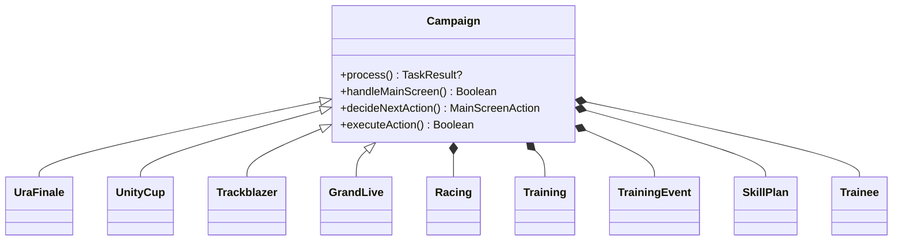
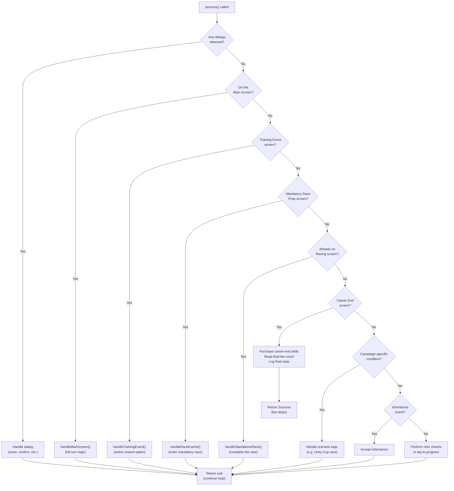
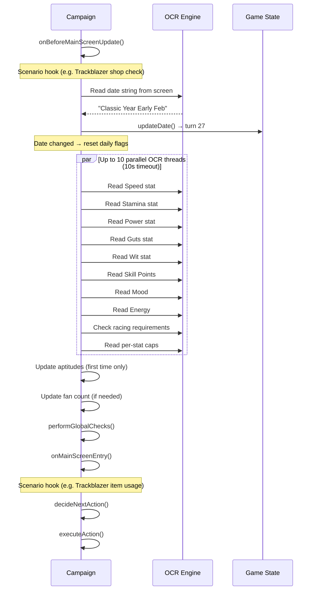
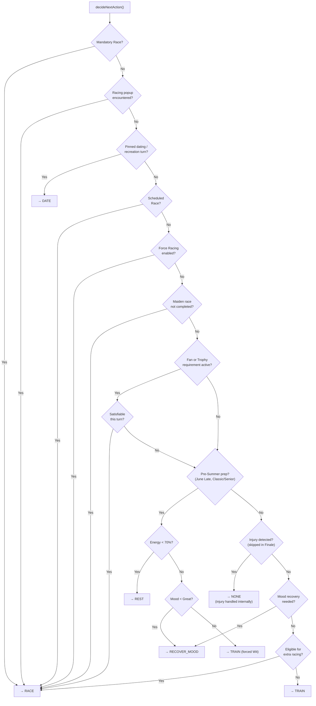
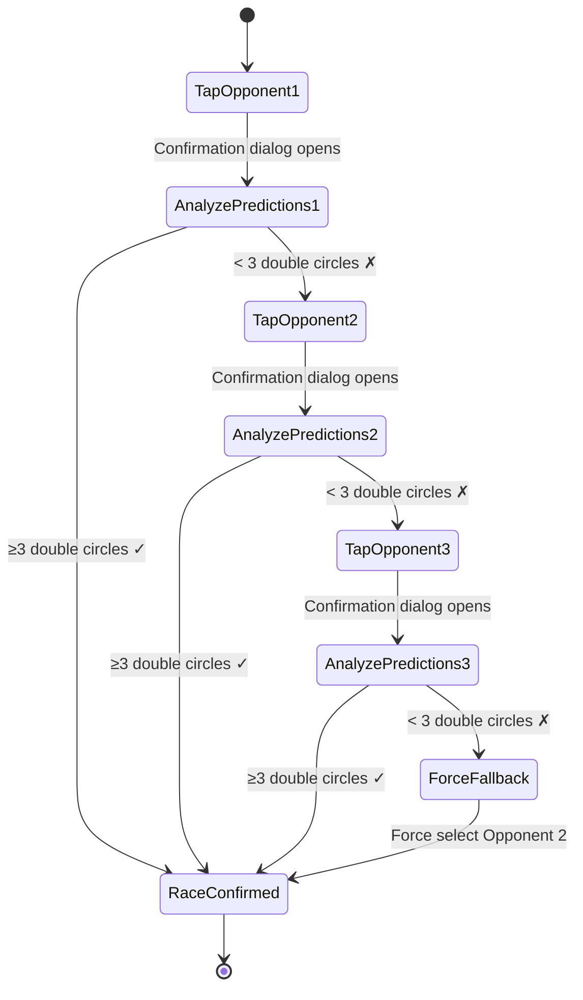
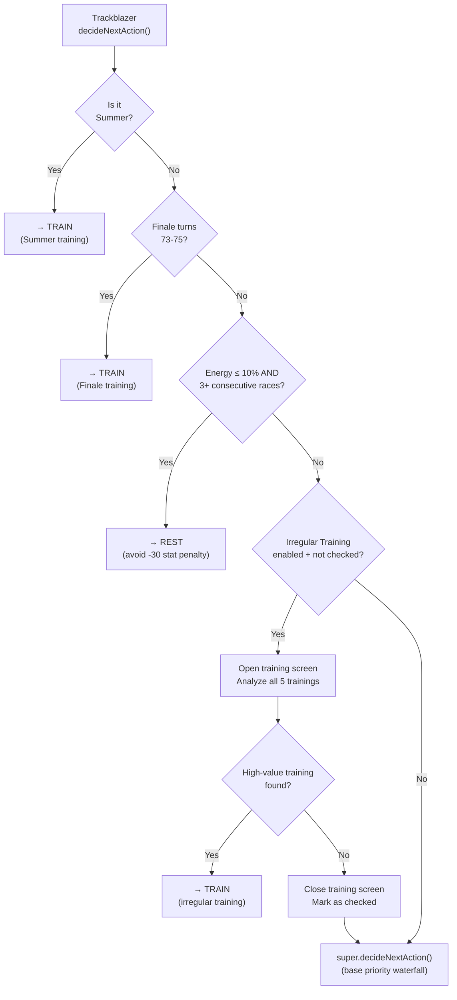
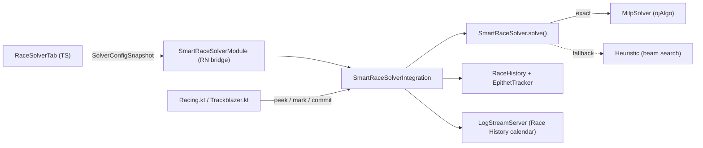

# How It Works

*Last updated: 2026-08-26*

A comprehensive guide to the inner workings of the app. This document explains what the bot does at each step of a campaign, how it makes decisions, and how each scenario differs.

## Table of Contents

- [1. Architecture Overview](#1-architecture-overview)
- [2. The Turn System](#2-the-turn-system)
- [3. The Main Loop](#3-the-main-loop)
- [4. A Turn in Detail](#4-a-turn-in-detail)
- [5. Decision Engine](#5-decision-engine)
- [6. Training System](#6-training-system)
- [7. Racing System](#7-racing-system)
- [8. Training Events](#8-training-events)
- [9. Scenario: URA Finale](#9-scenario-ura-finale)
- [10. Scenario: Unity Cup](#10-scenario-unity-cup)
- [11. Scenario: Trackblazer](#11-scenario-trackblazer)
- [12. Scenario: Grand Live](#12-scenario-grand-live)
- [13. Support-Card Dating Schedule](#13-support-card-dating-schedule)
- [14. Smart Race Solver](#14-smart-race-solver)
- [15. Ask the Docs Chatbot](#15-ask-the-docs-chatbot)
- [16. Decision Tracer](#16-decision-tracer)
- [17. Remote Log Viewer & Run Analytics](#17-remote-log-viewer--run-analytics)

---

## 1. Architecture Overview

The bot is an Android app built with a **React Native** frontend (settings UI, message log) and a **Kotlin** backend (automation engine). It uses the [Android CV Automation Library](https://github.com/steve1316/android-cv-automation-library) framework to interact with the game.

**How it sees the screen:** A `MediaProjectionService` captures the device screen. The bot then uses **OpenCV template matching** (TM_CCOEFF_NORMED with multi-scale search) to detect buttons, icons, and dialogs, **OCR** (Google ML Kit + Tesseract) to read text like stat values, event names, and race names, and optionally **YOLOv8 object detection** (via ONNX Runtime) to detect training stat gain digits with higher accuracy than template matching.

**How it interacts:** An `AccessibilityService` performs tap and swipe gestures on the device.

**How it bootstraps:** On first launch the entire app is gated behind a one-time **First-Run Wizard** — a single scrollable page of setup cards — instead of the old Home-screen permission dialog. The wizard is mounted by `useFirstRunGate()`, which reads and writes a `firstRun.completed` flag in SQLite so it only appears once. Card 1 asks where the bot should save its files: the user can pick any folder through the Android **Storage Access Framework (SAF)** picker, or fall back to **App default (internal storage)** (also used automatically on devices that have no document picker). Card 2 appears only when a scan finds files in the old `logs/` and `recordings/` locations and offers to **Move**, **Leave**, or **Delete** them. Card 3 is the **System Checks** list, which walks the user through the Accessibility, Display-over-other-apps (overlay), and Battery-optimization permissions; **Finish** stays disabled until all three are granted (and, for a SAF folder, a write-access probe succeeds).

File storage is brokered by the native `StorageBridgeModule`: logs and screen recordings are written under the chosen SAF tree (in `logs/` and `recordings/` subfolders) or under internal app storage when the fallback is selected. The older `PermissionSetupDialog` still exists on the Home page as an optional on-demand permission re-check, but it no longer drives first-run setup.

**How it decides:** The bot runs a `process()` loop that is called repeatedly by the `Game` class. Each call handles one "tick" — detecting which screen the game is on and taking the appropriate action.



The `Game` class instantiates the correct scenario subclass (`UraFinale`, `UnityCup`, `Trackblazer`, or `GrandLive`) based on the user's selection, then calls `process()` in a loop until the campaign ends or the bot is stopped.

---

## 2. The Turn System

A full campaign spans **75 turns** across 3 years plus a finale season:

| Year | Turns | Months |
|------|-------|--------|
| **Junior** | 1–24 | Pre-Debut (1–11), Debut Race (12), Post-Debut (13–24) |
| **Classic** | 25–48 | Regular (25–36), Summer (37–40), Regular (41–48) |
| **Senior** | 49–72 | Regular (49–60), Summer (61–64), Regular (65–72) |
| **Finale** | 73–75 | Qualifier (73), Semi-Final (74), Finals (75) |

Each year has 12 months with 2 phases each (Early and Late), totaling 24 turns per year. Months run from January through December.

```mermaid
gantt
    title Campaign Timeline (75 Turns)
    dateFormat X
    axisFormat %s
    section Junior Year
    Pre-Debut (1-11)     :a1, 1, 11
    Debut Race (12)      :milestone, m1, 12, 12
    Post-Debut (13-24)   :a2, 13, 24
    section Classic Year
    Regular (25-36)      :a3, 25, 36
    Summer (37-40)       :crit, a4, 37, 40
    Regular (41-48)      :a5, 41, 48
    section Senior Year
    Regular (49-60)      :a6, 49, 60
    Summer (61-64)       :crit, a7, 61, 64
    Regular (65-72)      :a8, 65, 72
    section Finale
    Qualifier (73)       :crit, a9, 73, 73
    Semi-Final (74)      :crit, a10, 74, 74
    Finals (75)          :crit, a11, 75, 75
```



> [!NOTE]
> Sections highlighted in red are **special periods** where normal gameplay rules change — Summer blocks racing entirely, and Finale forces mandatory back-to-back races.

**Key periods:**
- **Pre-Debut (turns 1–11):** No races are available yet. The bot focuses on training and building relationships.
- **Summer (turns 37–40 and 61–64):** Training-only period. No races can be entered (unless using the in-game race agenda override).
- **Finale (turns 73–75):** Three mandatory back-to-back races. Injury and consecutive race checks are skipped.

**Date detection:** The bot reads the date string from the screen via OCR (e.g., "Classic Year Early Feb") and converts it to an internal turn number. During Pre-Debut, it reads a "turns remaining" countdown instead. During Finale, it detects the goal text or Trackblazer's "X/3" indicator.

---

## 3. The Main Loop

Every tick of the bot calls `process()`, which checks the current screen and dispatches to the appropriate handler:



**Key points:**
- **Dialogs are always checked first.** Any popup (confirmation, warning, tutorial) is handled before any other logic runs.
- **Main Screen handling** is where the core turn logic lives — stat updates, decision-making, and action execution all happen here.
- **Training Events** appear after a training or race completes and offer reward choices.
- **Campaign-specific conditions** allow each scenario to inject custom screen detection (e.g., Unity Cup's opponent selection screen).
- If no known screen is detected, the bot taps the screen to try to progress past any intermediate animation or transition.

> [!TIP]
> The main loop is designed to be **idempotent** — each call to `process()` handles exactly one screen transition. If the game is between screens or in an animation, the bot simply taps and waits for the next tick.

> [!NOTE]
> **Warning-popup exit threshold.** When `performMiscChecks()` matches a `ButtonCancel` template, the bot does not exit immediately. It increments a `consecutiveButtonCancelMatches` counter and only exits once the counter reaches **5 consecutive iterations**, throwing a `CampaignBreakpointException` with a "Bot may have encountered a warning popup" notification. A single-frame template miss against an unrelated UI element no longer trips a false-positive exit. This replaced the old "Stop on Unexpected Popups" setting.

---

## 4. A Turn in Detail

When the bot detects it is on the Main Screen, `handleMainScreen()` orchestrates the full turn:



### 4.1 Parallel Turn-Start Updates

Every time the date changes, the bot reads the trainee's current state using up to **10 parallel OCR threads** coordinated by a `CountDownLatch` with a **10-second timeout**:

| Thread | Reads | Method |
|--------|-------|--------|
| 1–5 | Speed, Stamina, Power, Guts, Wit | `trainee.updateStats()` |
| 6 | Skill Points | `trainee.updateSkillPoints()` |
| 7 | Mood (icon-based detection) | `trainee.updateMood()` |
| 8 | Racing requirements (fans/trophies) | `racing.checkRacingRequirements()` |
| 9 | Energy (bar position) | `trainee.updateEnergy()` |
| 10 | Per-stat caps (the `/NNNN` denominators) | `trainee.updateStatCaps()` |

Threads 8 and 10 are conditional. Racing requirements are **skipped during summer** since no races are available, and the stat-cap thread is only spawned when **Read Stat Caps from Screen** is enabled — with the setting off those five extra OCR reads never run at all. Logging output is temporarily disabled during parallel reads to avoid garbled messages, then re-enabled after all threads complete.

> [!WARNING]
> If any thread fails to complete within the 10-second timeout, the bot logs an error and continues with whatever data it managed to read. Stat values that timed out retain their previous values.

### 4.2 Global Checks

After stat updates, the bot performs several global checks that can stop or pause the campaign:

1. **Pre-Finals Skill Shopping (turn 72):** If the `preFinals` skill plan is enabled, the bot opens the skill shop and purchases skills before entering the finale.
2. **Skill Point Threshold:** If skill points reach the configured threshold, the bot either runs the `skillPointCheck` skill plan or stops entirely.
3. **Stop Before Finals:** If `enableStopBeforeFinals` is on and the bot reaches turn 72, it stops so the user can take over for the finals.
4. **Stop at Date:** If the current date matches any user-configured stop dates, the bot stops.

> [!NOTE]
> **Skill-plan auto-purchase.** The skill plans referenced above (the skill-point-threshold plan, the pre-Finals plan, and the career-complete plan) auto-buy skills filtered two ways. The **Style** preferences — Running Style, Track Distance, and Track Surface "for Skills" — now strictly restrict which skills the auto-strategy considers, applied consistently across every spending strategy. Separate category-exclusion toggles drop whole groups from the plan: negative, green, red, unique, and the new **Skip Double-O (Circle) Skills** (`excludeDoubleCircleSkills`, default off), which buys only the single-circle version of an upgrade and skips the double-circle one. Skills the user adds to the plan by hand are always bought regardless of these exclusions.

#### Spending leftover points on the last purchase of a career

The career-complete purchase is the **last** time skill points can ever be spent, so anything still on the balance when it ends is lost outright. When the **Enable Career Complete Plan (Beta)** toggle is on (default off), the bot follows its normal plan first and then makes a final pass that tries to drain whatever is left over.

The drain treats the leftover balance as a **0/1 knapsack**: each candidate skill's price is used as both its weight and its value, so the subset it picks is the one that **spends the most points without going over**. Ties on amount spent are broken toward the higher-evaluation-point skills. Because buying a skill in an upgrade chain lowers the price of its upgrade (or reveals a new row), the pass re-runs up to **5 times** — but only when a pick actually had an upgrade, so it exits early in the common case.

Two deliberate asymmetries with normal purchasing are worth knowing:

- The per-skill **blacklist is honored** — a skill the user explicitly banned is never bought to burn points.
- The **category exclusions are ignored** (green, red/debuff, unique, double-circle), as are the aptitude preferences and the spending strategy. Those filters exist to steer *normal* purchasing toward useful skills, and applying them here would strand the very points the drain exists to spend.

> [!IMPORTANT]
> The balance is **not** guaranteed to reach zero, and a remainder is normal. The drain spends as much as it can, but it can only combine the prices actually on offer — if nothing sums exactly to the balance (the usual case, since prices are coarse), or every remaining skill costs more than what is left, the leftovers stay put. Expect the remainder to land below the cheapest affordable skill rather than at exactly 0.

The **Start Skill List Buy Test** debug test previews this: it runs the real drain code path against the live skill list, logs the skills it *would* buy and the skill points it expects to have left, and taps nothing.

### 4.3 Scenario Hooks

Each scenario can override these hooks to inject custom logic at specific points in the turn:

| Hook | When Called | Example Usage |
|------|-----------|---------------|
| `onBeforeMainScreenUpdate()` | Before date detection | Trackblazer: check if shop visit is needed |
| `onAfterTurnStartUpdates()` | After parallel OCR reads | Additional post-update logic |
| `onMainScreenEntry()` | Before decision-making | Trackblazer: use training items. Grand Live: log token totals, run the Lessons side-action |
| `onEndScreenEntry()` | On the career-end screen, before skills are bought | Grand Live: spend leftover Performance Points in Lessons |
| `onScheduledRacePrepScreen()` | On the Race Prep screen before a scheduled or mandatory race | Trackblazer: use race items (hammers, glow sticks) |
| `handleRaceEventFallback()` | When a race attempt fails (e.g. consecutive race limit) | Trackblazer: back out and train instead (non-mandatory races only) |
| `resetDailyFlags()` | When date changes | Reset scenario-specific per-turn flags |

---

## 5. Decision Engine

The `decideNextAction()` method determines what the bot should do this turn. It follows a strict **priority waterfall** — the first matching condition wins:



**Priority explanations:**

1. **Mandatory Race:** If the game shows a mandatory race ribbon (career-goal or race-day), the bot must race. No choice here.
2. **Racing popup:** If a previous race selection triggered a popup that wasn't fully resolved, continue with racing.
3. **Dating/Recreation outing (`DATE`):** If the dating schedule is active and today is a pinned (or catch-up) recreation turn with no mandatory race, the bot spends the turn on the outing. This **outranks** scheduled agenda races and Smart Race Solver races. See [Section 13](#13-support-card-dating-schedule).
4. **Scheduled Race:** If the game shows a scheduled (in-game agenda) race label, the bot races.
5. **Force Racing:** User setting that bypasses all other logic and forces racing every turn.
6. **Maiden Race:** The first race of the campaign must be completed before regular training resumes.
7. **Fan/Trophy Requirements:** If the game requires a minimum fan count, trophy count, or goal race points, the bot prioritizes racing to meet it. This **outranks** pre-summer prep so a mandatory career goal is never skipped in favor of a summer-prep training. The requirement must be **satisfiable this turn**, though: a trophy goal that only a **G1 win** can satisfy is checked against the races database first, and on a turn with no G1 available the bot does not open the race screen at all (it would only have to cancel back out of it) and falls through to the rest of the waterfall instead. Every other requirement — a fan count, goal race points, or a trophy that any Pre-OP-or-above / G3-or-above race can satisfy — always forces the race.
8. **Pre-Summer Prep (June Late):** On the last turn before Summer training, the bot ensures energy is high (≥70%) and mood is Great. If energy is low, it rests. If mood is low, it recovers mood. If both are fine, it trains Wit (which recovers some energy in preparation for Summer Training).[^1]

[^1]: Wit is chosen as the "throwaway" training because it recovers some energy, helping the trainee enter Summer Training in better condition.
9. **Injury Check:** If an injury is detected, the bot handles it (usually by resting). This check is **skipped during Finale turns** since those races are mandatory.
10. **Mood Recovery:** If mood has dropped to Normal or below, the bot recovers before training (bad mood penalizes training gains).
11. **G1-Day Pre-Screen:** If `enableG1DayPreference` is on and a G1 race is available this turn (Classic / Senior, outside summer and finals, energy at or above the `Minimum Energy for G1 Pre-Screen` floor), the bot peeks at the training screen first and stays to train when the best training carries at least `g1DayMinRainbowCount` rainbow supports. This runs **before** the extra-race check, so it can pass on a G1 the Smart Race Solver had scheduled.
12. **Extra Racing:** If the bot is eligible for extra races (the Smart Race Solver planned one for this turn, or the scenario bypasses smart racing), it races.
13. **Low-Energy Rest:** If energy is below `minEnergyToTrain` (and it is not summer or the finals), the bot rests. Checked this late so it only ever replaces a training turn — every racing path above has already returned by now.
14. **Default: Train.** If nothing else applies, the bot trains.

> [!NOTE]
> **Trackblazer override:** Before calling the base decision logic, Trackblazer's `decideNextAction()` first checks for **Irregular Training** — evaluating whether a high-value training opportunity exists that's worth skipping a race for. See [Section 11.6](#116-irregular-training) for details.

---

## 6. Training System

The training system analyzes all 5 training options (Speed, Stamina, Power, Guts, Wit), scores them, and selects the best one.

### 6.1 Training Analysis Pipeline

When `analyzeTrainings()` is called:

1. **Iterate all 5 stats:** For each stat, the bot clicks the corresponding training tab button.
2. **Stat gain detection per training:**
   - Main stat gain and sub-stat gains (detected via template matching or optionally **YOLO** — see below)
   - Failure chance percentage
   - Relationship bar colors (blue, green, orange) for support card characters present
   - Rainbow count (number of rainbow indicators)
   - Skill hints available
3. **Results are cached** for the current turn, **keyed by the turn number** (`cachedAnalysisTurn == campaign.date.day`), so the training screen can be visited several times in one turn without re-reading it. The turn key is what makes the cache safe: a previous turn's analysis — including any bad failure-chance read baked into it — can never be reused on a later turn. The cache is also cleared outright at the end of each training attempt.
4. **Filtering:** Trainings exceeding the maximum failure chance threshold (default 20%) are excluded, unless risky training mode or Good-Luck Charm overrides are active.
5. **Train or rest:** The bot rests only when **every** facility was filtered out. If the five facilities are empty because they were all blacklisted or restricted rather than too risky, that is not an energy problem and resting cannot fix it, so the bot does not rest.

> [!NOTE]
> **Reading the failure chance.** The percentage is OCR'd with the **digit-constrained** engine rather than the general text recognizer, which used to misread a 0% bubble as a letter and throw the read away. The parser then takes only the digit run immediately before the `%` sign instead of concatenating every digit it can see in the crop — the old behavior fused stray digits out of a low-contrast bubble into phantom values like 10% or 12%. Any value above 100 is rejected outright rather than "repaired", and each read gets three attempts against a fresh screen capture, accepting only a result in 0–100.
>
> As a second line of defense, a facility whose reported failure chance overshoots what its energy level can plausibly produce (by more than 30 points) is **clamped down** to the energy-based estimate, so a spurious 99% read at full energy cannot strand the bot in an endless rest loop. Facilities with a Unity Cup burst ready are exempt, since their genuine 0% is real and must not be "corrected" upward.

> [!NOTE]
> **First-failure-chance OCR retry.** If the failure-chance read on a Training screen entry still comes back unparseable after its three internal attempts, `recoverAndRetryFailureChance()` clicks back out and re-enters the Training screen once before giving up. This catches the case where the number hasn't fully rendered yet on the first frames the bot captures.

> [!IMPORTANT]
> **The Speed facility no longer decides the turn.** The bot used to read the Speed facility's failure chance first and rest immediately if it looked too risky, without ever checking the other four — which was systematically wrong, since Wit is the safest facility and was never consulted. All five facilities are now always analyzed, and the Speed read is only used for logging and as a fallback seed for a misread.

**YOLO Stat Detection:** When `enableYoloStatDetection` is enabled, stat gain digits are detected using a **YOLOv8 nano** model (`best.onnx`) instead of template matching. The model is trained to detect 11 classes (digits 0–9 and the '+' symbol) in small 130x50 pixel crop regions for each stat. It runs via ONNX Runtime with a confidence threshold of 0.8 and IoU threshold of 0.45 for NMS. The `YoloDetector` is loaded once as a singleton and kept in memory. Both detection methods coexist — the setting controls which one is used at runtime. The YOLO training pipeline and model export tools live in the [yolo/](yolo/) directory.

### 6.2 Scoring Algorithm

Each training option receives a weighted score from `calculateRawTrainingScore()`:

$$\text{Score} = \bigl(\text{StatEfficiency} \times w_{\text{stat}} + \text{Relationship} \times w_{\text{rel}} + \text{Misc} \times w_{\text{misc}}\bigr) \times \text{RainbowMultiplier}$$

| Component | Weight (with relationships) | Weight (without) | What It Measures |
|-----------|---------------------------|-------------------|-----------------|
| Stat Efficiency | 60% | 70% | How much the stat gain moves toward the target for the trainee's distance |
| Relationship | 10% | 0% | Support card relationship bar progress (blue = 2.5, green = 1.0, orange = 0.0) |
| Misc | 30% | 30% | Mood gain, bond progress, skill hints, and other bonuses |

**Rainbow Multiplier:**
- If rainbow training bonus is enabled: **2.0x**
- If rainbow training bonus is disabled but rainbows are present: **1.5x**
- No rainbows: **1.0x**

Rainbow training is heavily favored because it improves overall stat ratio balance. Applied only from Classic Year onward.

**Anticipatory Rainbow Multiplier (`enablePrioritizeNearMaxFriendship`, default on):** From Classic Year onward, when a training has **no real rainbows** but does have green/blue friendship bars sitting near the rainbow threshold, the bot applies a smaller anticipatory bonus to reward the "almost-rainbow" turn. Each qualifying bar contributes `fillPercent / 100` to a sum, then the multiplier is `1.0 + min(0.6, 0.2 * sum)` — capped at **1.6x** so anticipation can never out-rank an actual rainbow training (which sits at 1.5x / 2.0x). Only green/blue bars above 10% fill count. The intent is to lean toward trainings that are one bond tick away from becoming real rainbows without overruling a stat that already is one.

**Training Level Weighting (`enableTrainingLevelWeighting`, default on):** When enabled, each option's main-stat score is amplified by a multiplier derived from the **OCR-detected training facility level** (1–5). Only the user's **top three priority stats** receive any boost, and only training levels ≥ 2 matter. At Lvl 5 the multipliers are roughly rank 1 = 1.75x, rank 2 = 1.25x, rank 3 = 1.10x. The fade keeps the boost concentrated on the trainee's top priority while still rewarding investment in their secondary. Training levels are OCR'd from each facility tab, anchored against the Energy label location which is cached on first use.

> [!IMPORTANT]
> **Stat Cap Awareness:** If a stat is at or above its cap, training for that stat scores **0** and is skipped. Below that there is a buffer (cap - 100, relaxed by 15 per remaining finale race), above which a stat gets a **one-time rainbow allowance** — it can be trained past the buffer once if the training is a rainbow and that stat hasn't used its allowance yet.

### 6.3 Stat Caps and the Beyond-1200 Zone

The July 2026 rebalance changed what a stat cap *is*, and the bot now models it in two parts.

**Caps are per scenario, and no longer 1200 across the board.** The base (spark-free) caps the bot assumes are:

| Scenario | Cap |
|----------|-----|
| **URA Finale** | 1400 for all five stats |
| **Unity Cup** | 1800 Wit, 1300 everything else |
| **Trackblazer** | 1900 Stamina, 1500 Wit, 1200 everything else |
| **Grand Live** | 1600 Speed, 1500 Guts, 1300 everything else |
| Anything else | 1200 |

**1200 is now a soft threshold, not a wall.** Stats keep climbing past it toward the real cap, just at reduced value — and the headline change is *how much* reduced. A point landing above 1200 used to be worth roughly an eighth of a normal point; it is now worth exactly **half**. The bot splits any proposed gain into the portion below 1200 (counted in full), the portion between 1200 and the stat's real cap (counted at 0.5), and any overflow past the cap (counted at zero, since it is simply wasted), and scales that stat's score by the resulting fraction. A +30 Speed training on a 1190 Speed with a 1400 cap therefore counts as `(10 x 1.0 + 20 x 0.5) / 30 = 0.667` of its face value.

The practical effect is that the bot no longer treats a stat as "done" at 1200, but it also stops dumping everything into one stat once it crosses — the halved value naturally makes the other four more attractive.

**Caps are read off the screen, not assumed.** Sparks, inheritance, URA duel wins, and Unity Cup extreme bursts all raise a stat's real cap above the base, so the table above is only a fallback. With **Read Stat Caps from Screen** enabled (default on), the bot OCRs the `/NNNN` denominator under each stat every turn as part of the parallel turn-start reads. A read is only accepted if it lands in a plausible 1000–2000 range **and** is at least the scenario's base cap, since sparks only ever raise a cap — a lower number is a misread. A stat whose read fails silently keeps its previous cap rather than dropping to a bad value. Turning the setting off skips those reads entirely and falls back to the static table.

Once caps are known they show up in the trainee stats log line as `Spd=252/1480, Sta=104/1400, ...`.

> [!NOTE]
> At the end of a run the bot re-reads the caps from the in-game **Umamusume Details** dialog, which prints them far more legibly than the cramped main-screen crop, so the final stats line and the dashboard show the caps the trainee actually finished with. This read is independent of the per-turn setting above.

### 6.4 Special Training Modes

<details>
<summary><strong>Risky Training</strong></summary>

When enabled, the bot will accept trainings with higher failure chances if the stat gain is large enough:
- **Minimum stat gain:** Configurable (default 20)
- **Maximum failure chance:** Configurable (default 30%)

This overrides the normal failure chance filter for trainings that meet both thresholds.
</details>

<details>
<summary><strong>Rainbow Training Bonus</strong></summary>

When enabled, rainbow trainings receive a 2.0x score multiplier instead of 1.5x. This makes the bot more aggressively pursue rainbow training opportunities, which provide balanced stat gains across multiple categories.
</details>

<details>
<summary><strong>Train Wit During Finale</strong></summary>

During Finale turns (73–75), if the trainee's energy is too low for optimal training, the bot normally rests. With this setting enabled, it **trains Wit instead of resting**, since:
- Energy recovery is less valuable when only 1–3 turns remain
- Wit training typically has low failure chance
- On turn 75 (the final turn), resting is completely pointless, so Wit is always forced
</details>

<details>
<summary><strong>Skill Hint Prioritization</strong></summary>

When enabled, the bot adds bonus weight to trainings that offer skill hints, making it more likely to choose trainings where support cards are offering learnable skills.

Before committing to a hint, the bot checks that the hinted training is actually safe to take. When it spots a skill-hint icon it maps the icon to the nearest training button to learn which stat it belongs to, navigates to that facility, and reads its failure chance. The hint is only tapped if that failure chance is within the active threshold — or if the check is bypassed because it is a Finals turn or a Good-Luck Charm is active. Otherwise the bot falls back to normal training analysis and picks a safer training instead of tapping the hint blindly.
</details>

<details>
<summary><strong>End-of-Year Milestone Stat Targets</strong></summary>

The bot supports configurable per-year stat targets (End of Junior / End of Classic Year Milestones). When enabled, training selection biases toward stats that are still short of their milestone target for the current year, helping the trainee hit each year's stat goals before the next phase.
</details>

<details>
<summary><strong>Disable Per-Distance Stat Targets</strong></summary>

When `disableStatTargets` is enabled, the per-distance stat targets that normally drive the Stat Efficiency component are ignored — every stat is treated as if its target equals **that stat's own cap**. Since caps are now read live ([Section 6.3](#63-stat-caps-and-the-beyond-1200-zone)), a trainee who sparked Speed up to 1480 in URA Finale gets a Speed target of 1480 rather than a flat scenario number. This keeps every stat's ratio multiplier in the "encourage training" band rather than letting it taper off once the per-distance target is reached, which is useful for runs where the user wants to push every stat as high as possible regardless of the trainee's distance preference.
</details>

<details>
<summary><strong>Training Blacklist (and the Junior-year exception)</strong></summary>

Stats on the training blacklist are never selected — **except during Pre-Debut and Junior Year (turns 1–24)**, where the blacklist is ignored entirely.

That window is exactly when the bot scores trainings by **friendship** rather than stat efficiency: it is not chasing stats at all, it is ranking facilities purely by support-card relationship bars to build bonds as fast as possible. A user who blacklists Guts to avoid Guts *stats* would otherwise also block the bot from ever visiting the Guts facility to bond with the support cards sitting there, permanently crippling those cards' rainbow potential for the rest of the run. Normal blacklist enforcement resumes at turn 25.
</details>

<details>
<summary><strong>Training Failure Fallbacks</strong></summary>

When every training option is filtered out by the failure-chance or stat-cap rules, the bot follows a configurable fallback chain (e.g. rest, recover mood, or force Wit) instead of stalling on the turn. The fallback decision also respects negative statuses — for instance, with active negative conditions the forced fallback is Wit rather than Speed to avoid stat reductions from conditions like Slow Metabolism.
</details>

<details>
<summary><strong>Per-Context Stat Priorities</strong></summary>

The Training Settings page exposes three stat-priority lists instead of one:

- **Training stat priority** — used by the per-turn training scorer (the existing behavior).
- **Event choice stat priority** — used by [Section 8.3](#83-default-scoring) when scoring training-event option text. Falls back to the training list if left empty.
- **Summer training stat priority** — used during Summer turns (37–40 and 61–64), when the trainee is barred from racing and the optimal stat to push is often different from the rest-of-year priority. Falls back to the training list if left empty.

This lets the user, for example, push Speed during the year but lean into Stamina or Wit during Summer Training without having to flip the global priority.
</details>

### 6.5 Training Configuration Summary

| Setting | Default | Effect |
|---------|---------|--------|
| Stat Prioritization | Speed, Stamina, Power, Guts, Wit | Order determines scoring weight for stat gains |
| Training Blacklist | (empty) | Stats in this list are never selected, except during Pre-Debut / Junior Year |
| Max Failure Chance | 20% | Trainings above this are filtered out |
| Disable on Maxed Stat | true | Skip training for stats at/above buffer |
| Rainbow Training Bonus | false | 2.0x multiplier for rainbow trainings |
| Prioritize Near-Max Friendship | true | Anticipatory rainbow multiplier (up to 1.6x) in Year 2+ for green/blue bars near the rainbow threshold |
| Train Wit During Finale | false | Wit training instead of resting during finale |
| Risky Training | false | Accept higher failure for larger gains |
| Training Level Weighting | true | Amplify top-3 priority stats by OCR-detected facility level (1-5) |
| Disable Per-Distance Stat Targets | false | Treat every stat's target as that stat's own cap |
| Read Stat Caps from Screen | true | OCR each stat's live cap every turn so spark / inheritance / duel cap gains are respected |

---

## 7. Racing System

The racing system handles race detection, selection, execution, and result processing.

### 7.1 Race Types

| Type | Detection | When |
|------|-----------|------|
| **Mandatory** | `IconRaceDayRibbon` or `IconGoalRibbon` | Game-forced races (Debut, Finale, goal races) |
| **Scheduled** | `LabelScheduledRace` | Races from the user's in-game agenda |
| **Extra** | Eligibility check | The Smart Race Solver's schedule, force racing, or a scenario bypass |
| **Maiden** | First race flag | Must be completed once before regular training |

### 7.2 Extra Race Eligibility

The bot determines if extra races should be run via `checkEligibilityToStartExtraRacingProcess()`. The guards are checked in order and the first one that matches wins:

- **Junior Year Early July (Turn 13):** No extra races exist yet, so the check bails immediately.
- **Limit Extra Races to Agenda:** With the in-game race agenda active and `limitRacesToInGameAgenda` on, only agenda races run, so the check bails.
- **Force Racing:** Always race if the setting is enabled.
- **Unsatisfiable requirement:** A fan / trophy / goal-points requirement that survived the waterfall is one no race this turn can satisfy, so extra racing is suppressed rather than opening the race screen only to cancel.
- **Smart Race Solver:** From Classic year onward, the optional [Smart Race Solver](#14-smart-race-solver) is the only source of discretionary extra races — see Section 14. When it's enabled with `enableForceRacing` off, the solver decides which turns are race turns and which races are picked. When the solver picks `Train` for a turn, every extra-race fallback is **suppressed entirely** — the bot will not enter a race that the solver did not plan.
- **Scenario bypass:** Trackblazer races as often as possible via `shouldBypassSmartRacing()`, subject only to finals, summer, and the races button being unlocked.

With the solver off and no scenario bypass, the bot runs **no discretionary extra races at all** — only mandatory, maiden, scheduled, requirement-driven, and force-racing entries remain.

> [!NOTE]
> **Fan and trophy requirements are handled upstream**, in the decision waterfall ([Section 5](#5-decision-engine)), not here. By the time the eligibility check runs, any requirement still outstanding is by construction one that *cannot* be satisfied this turn — a G1-only trophy goal on a turn with no G1 race — so the check suppresses extra racing rather than triggering it.

> [!IMPORTANT]
> **Trackblazer** bypasses smart racing logic entirely and races as aggressively as possible, only stopping for summer, finals, or when the consecutive race limit is reached.

### 7.3 Race Selection

When the bot decides to race:

1. **Open the race list** and scan available races.
2. **Database lookup:** Each detected race name is matched against an internal race database keyed by turn number. The database contains grade, fan reward, surface, and distance information. Before matching, the OCR'd name is repaired for the classic letter-for-digit confusion (`300Om` becomes `3000m`), and any fuzzy candidate whose database distance contradicts the `(Long)` / `(Mile)` / `(Med)` / `(Sprint)` category spelled out in the detected name is thrown away — without that gate, fuzzy matching happily scores a 3000m Long race at ~0.9 against an 1800m Mile race on the same track.
3. **Grade priority:** G1 > G2 > G3 > OP > Pre-OP. Higher-grade races are always preferred.
4. **Filtering:** Races can be filtered by minimum fan threshold, preferred terrain, preferred grades, and preferred distances.
5. **Selection:** The highest-priority race that passes all filters is selected.

### 7.4 Race Execution

Once a race is selected:

1. **Strategy Selection:** The bot selects a running strategy (Front Runner, Stalker, Betweener, or Chaser) based on the trainee's aptitudes. If **per-distance strategies** are enabled in Racing Settings, the bot resolves the strategy separately per distance bucket (Sprint, Mile, Medium, Long) against the currently detected `lastRaceDistance`, overriding the global strategy for that race. For **mandatory races** (which skip the normal race-list selection flow), the bot reads the race distance directly off the Race Prep screen so per-distance strategies still apply on Debut, goal, and Finale turns.
2. **Skip or Manual:** If the "skip" button is available, the bot skips the race animation. Otherwise, it watches and fast-forwards.
3. **Retries:** If a race is lost and retries are enabled, the bot can retry it. Retries are governed by **two budgets**, and a single check applies both wherever a retry is attempted:
   - A **run-wide pool** (default 3, Trackblazer 5) shared across the whole career. Nothing is exempt from it — when the pool is empty, retrying stops.
   - A **per-race cap** (default 1) limiting how many times any single race is re-run.

   The per-race cap is **waived for races that retry until 1st** — mandatory races (Debut, goal, and Finale) and, when **Retry Unity Cup Races** is on, Unity Cup races. Those keep retrying for the win as long as the run-wide pool holds out, rather than settling for a lower placement. This is what made a mandatory race stop retrying after a single attempt even with retries left in the pool.
4. **Complete Career on Failure:** If a mandatory race is lost and this setting is enabled, the bot continues the campaign anyway rather than stopping.

> [!NOTE]
> **Two fixes worth knowing about, both on the mandatory-race path.** A training or rest action can drop the game straight onto a mandatory race screen without passing through the Main screen, where the turn's date is normally read. The bot used to look the race up against the **previous** turn's number, match the wrong race, and pick the wrong running style for it — so it now re-reads the date when it lands on a mandatory race prep screen having not yet read it this turn. (The Unity Cup opponent-selection screen is the one exception: it carries neither OCR anchor the date read needs, and Unity Cup never looks a race up by turn anyway.)
>
> Separately, a retry used to **cancel itself**. The in-game "Try Again" dialog does not vanish the instant it is tapped, so the next pass of the loop would find the same dialog still on screen and close it — killing the retry that had just been started. The bot now waits for the dialog to actually go away before continuing.

> [!CAUTION]
> Losing a mandatory race without `enableCompleteCareerOnFailure` will **stop the bot entirely**. If you want fully unattended runs, make sure this setting is enabled.

---

## 8. Training Events

Training events are popup screens that appear after training or racing, offering the player a choice between 2+ reward options.

### 8.1 Event Detection

1. The bot detects the training event screen via template matching (`IconTrainingEventHorseshoe`).
2. **OCR reads** the event title and the character or support card name.
3. **Fuzzy string matching** (Jaro-Winkler algorithm) compares the detected text against the event database to identify which event this is and what each option rewards.

### 8.2 Override System

The bot checks for overrides in this priority order:

| Priority | Override Type | Description |
|----------|--------------|-------------|
| 1 | **Special Event** | Hardcoded overrides for game-critical events (New Year's, Shrine Visit, etc.) |
| 2 | **Character Event** | User-configured choice for a specific character's events |
| 3 | **Support Event** | User-configured choice for a specific support card's events |
| 4 | **Scenario Event** | User-configured choice for scenario-specific events |
| 5 | **Default Scoring** | Weighted algorithm (see below) |

If any override matches, its configured option is selected immediately without scoring.

### 8.3 Default Scoring

When no override applies, each option receives a weight score based on its rewards:

| Reward Type | Weight | Notes |
|-------------|--------|-------|
| "Can start dating" | +1000 | Extremely high priority — unlocks dating events |
| "Event chain ended" | -300 | Penalty — ending an event chain loses future rewards |
| "(Random)" | -10 | Small penalty for uncertain outcomes |
| "Randomly" | +50 | Mild bonus for partially random outcomes |
| Energy gain | value × multiplier | Multiplier scales with current energy[^2] (4x at <30%, 3x at <50%, 2x at <70%, 0x at ≥90%). If "Prioritize Energy" is enabled, multiplier is 100x |
| Mood gain | 80–150 | Higher weight when mood is lower (150 at Awful, 0 at Great). Mood loss: -150 |
| Bond gain | +20 | Bond loss: -20 |
| Skill hint | +25 | Learning a new skill |
| Positive status | +100 | Gaining a beneficial condition (e.g. Practice Perfect) - weighted to beat a typical flat stat line |
| Negative status | -25 | Gaining a harmful condition |
| Stat gain (priority stat) | value + 10–50 bonus | Bonus based on stat priority rank (1st: +50, 2nd: +40, 3rd: +30, 4th: +20, 5th: +10) |
| Stat gain (other) | raw value | No priority bonus |
| Skill points | raw value | Direct skill point gains |

[^2]: The energy multiplier is intentionally aggressive — at low energy, even small energy gains receive high scores because training at low energy carries significant failure risk.

The option with the **highest total weight** is selected.

> [!TIP]
> You can override the bot's event choices for specific characters, support cards, or scenario events in the **Training Event Settings** page. Overrides take priority over the scoring algorithm, letting you force a specific option for events you know are better than what the bot would calculate.

---

## 9. Scenario: URA Finale

URA Finale is the **simplest scenario** — decision logic, training, racing, events, and finale handling all use the standard base implementation described in sections 3–8. It adds only two things of its own: a different fans-panel button location (`openFansDialog()` uses `ButtonHomeFansInfo` in the top half of the screen), and the **Happy Meek duel** introduced by the July 2026 rebalance.

> [!TIP]
> If you're new to the bot, URA Finale is still the best scenario to start with — the duel below is the only scenario-specific behavior, and it is off the critical path.

### 9.1 The Happy Meek Duel

On some turns the game offers **"Happy Meek's Challenge!"** — a duel that, if won, **raises the cap on a stat and boosts it**. It surfaces in two places:

- On the **training screen**, a duel badge sits on exactly one of the five facilities that turn.
- If the bot trains that facility, the **duel event** fires, offering a row per stat ("Contest of Speed!", and so on) with a **win-prediction icon** beside each.

**Detecting the event.** The duel is not in the event database, so the normal fuzzy title match would confidently resolve it to some unrelated event and pick that event's options. The bot instead dispatches on the **raw OCR'd title** — if it reads "Happy Meek" and "Challenge", the duel handler takes the event regardless of what the fuzzy matcher thinks it is.

**Picking a contest.** Each row's prediction is read from its icon and graded Great > Good > Bad > Worst (a row matching none of the three icon templates is the untemplated "X" tier, and grades as Worst). The bot prefers a contest that is both **on a stat it actually wants** (from the Event Choice stat priority) **and** has **Good-or-better odds**. If no row satisfies both, it falls back to simply taking the best odds on offer. Ties break toward the higher-priority stat, then the earlier row. The "Contest of energy" row is recognized as not-a-stat and never counts as a preferred pick.

**Biasing training toward the duel.** Winning the duel is only possible if the bot trains the badged facility in the first place, so **Happy Meek Duel Bias** (Scenario Overrides → URA Finale) multiplies that facility's score:

| Setting | Multiplier | Behavior |
|---------|-----------|----------|
| `Off` | 1.0x | Never steer toward the duel facility |
| `Moderate` *(default)* | 1.25x | Wins when the duel facility is within ~20% of the best pick |
| `Aggressive` | 1.6x | Strongly prefers the duel facility |

The bias is deliberately conservative about safety: it is **not** applied if the facility's failure chance is unreadable or above the user's maximum, and it never boosts a facility already scoring zero. A risky duel is left alone rather than forced. The badge is located once per turn and its screen position mapped to a facility column, so the five per-facility analyses just read the answer instead of re-matching the badge five times.

The duel prints its own summary (the contests, their predictions, and which one was taken) and suppresses the generic event summary, which would otherwise report the rewards of whatever unrelated event the fuzzy matcher had landed on.

### 9.2 Finale Behavior

**Finale behavior (turns 73–75):**
- All 3 finale races (Qualifier, Semi-Final, Finals) are **mandatory**.
- **Injury checks are skipped** during the finale since the races must be run regardless.
- **Consecutive race warnings** are automatically confirmed.
- If `trainWitDuringFinale` is enabled, the bot trains Wit instead of resting between finale races.
- If `enableStopBeforeFinals` is enabled, the bot stops at turn 72 so the user can manually handle skill purchases or other preparations.
- If the `preFinals` skill plan is enabled, the bot automatically purchases skills on turn 72 before entering the finale.

---

## 10. Scenario: Unity Cup

Unity Cup adds a unique opponent selection and race system on top of the base campaign.

### 10.1 Tutorial Handling

The first time a Training Event screen appears, the bot checks for the Unity Cup tutorial header (`IconUnityCupTutorialHeader`). If detected, it selects the second option to close it and sets a flag to skip this check on subsequent turns.

### 10.2 Opponent Selection

When a Unity Cup race is triggered, the bot enters an opponent selection screen with 3 opponents to choose from:



**How it works:**

1. The bot detects 3 opponent positions via `LabelUnityCupOpponentSelectionLaurel`.
2. Starting with Opponent 1, it taps the opponent and then the "Select Opponent" button.
3. A confirmation dialog opens showing race predictions. The bot counts **double circle icons** (`IconDoubleCircle`) in the middle region of the screen.
4. If **3 or more double circles** are found → the matchup is favorable. The bot confirms the selection.
5. If fewer than 3 → the bot closes the dialog and tries the next opponent.
6. **Fallback:** If all 3 opponents fail the threshold, the bot **forces selection of Opponent 2** as a compromise.

> [!CAUTION]
> The fallback always picks Opponent 2 regardless of prediction quality. If all opponents are unfavorable, the race may be lost.

### 10.3 Race Execution

After selecting an opponent:

- The bot checks if the "See All Race Results" button is **locked** (via `checkDisabled()`).
  - **Locked:** The bot clicks "Watch Main Race" and runs the race manually with retries. When **Retry Unity Cup Races** is on (default), a lost race is re-run until it is won or the run-wide retry pool is exhausted, ignoring the per-race cap — see [Section 7.4](#74-race-execution).
  - **Unlocked:** The bot clicks the skip button to instantly see results.
- The race sequence ends when `IconUnityCupRaceEndLogo` is detected, at which point the bot clicks "Next" to return to the main screen.
- **Finals race** (`ButtonUnityCupRaceFinal`): When racing Team Zenith in the finals, the bot sets `bIsFinals = true` which auto-confirms the opponent dialog without prediction analysis.

### 10.4 Training Scoring

Unity Cup uses a modified training scoring mode during Junior and Classic years that factors in the **Spirit Gauge** mechanic. The July 2026 rebalance added a second, stronger burst on top of the existing Spirit Explosion, so the bot now recognizes three gauge states per facility and scores them in the order **Stats > Extreme Burst > Spirit Explosion > Gauge Filling**.

The **Extreme Spirit Burst** (purple flames, as against the normal burst's teal) is a one-time, cap-raising, 0%-fail burst — by far the most valuable thing on the screen. Its bonus is sized to always outrank a normal burst, and unlike the normal burst it carries no facility preference: if an extreme burst is available, the bot goes and takes it.

| Bonus | Default | Formula |
|-------|---------|---------|
| **Extreme Spirit Burst** | 2000 base + 1000 per ready support | `base + count x perGauge` |
| **Spirit Explosion (normal burst)** | 800 base + 400 per gauge | `base + count x perGauge`, then facility preference |
| **Gauge Fill** | 60 base + 40 per fillable gauge | `base + count x perGauge`, +100 flat during Junior Year |
| **Relationship** | 1.5x | Scaled relationship score |

Facility preference applies only to the **normal** burst: +200 for Speed and Wit, +150 for Stamina/Power when that stat is still under 80% of its target, and Guts gets +100 only if it can fill 2 or more gauges (otherwise -50, since Guts is a poor burst target on its own). Every bonus above is a tunable slider under the scoring constants.

**From Senior Year onward** the scenario reverts to standard stat-efficiency scoring ([Section 6.2](#62-scoring-algorithm)) — with one carve-out. An extreme burst is near-mandatory whenever it shows up, so its bonus is still added on top of the base score in Senior year. Normal bursts and gauge-filling stay Junior/Classic-only.

**Gating the bursts.** Three optional overrides (Scenario Overrides → Unity Cup) let the user stop the bot from chasing a burst onto a stat it does not want. All three default to off / unrestricted:

| Setting | Default | Effect |
|---------|---------|--------|
| **Burst Failure-Chance Exemption** | 0 (disabled) | Lets a training with a normal burst ready run up to this failure chance before being skipped. 0 keeps the normal failure limit. |
| **Extreme Burst Minimum Stat Gain** | 0 (always burst) | Only prioritize an extreme burst when the facility's projected main-stat gain is at least this value, so a weak stat turn doesn't waste the one-time burst. |
| **Burst Only Top 3 Stats After Junior** | false | After Junior Year, only prioritize bursts (normal *and* extreme) on facilities whose stat is in the top 3 priorities. Junior Year stays unrestricted. |

A burst blocked by any of these gates is treated as if it were not there at all. An **extreme** burst bypasses the failure-chance ceiling entirely (it cannot fail in-game), whereas a **normal** burst only earns its raised ceiling if it also clears the Risky Training minimum main-stat-gain threshold (default 20) — a training too weak to earn the risky ceiling is too weak to earn the burst ceiling. That last gate is inert unless Risky Training is on.

### 10.5 Spirit Gauge Detection

The gauge is a droplet sitting at a fixed slot to the left of each support's training icon, and detecting it reliably took two fixes worth knowing about.

**Fillable gauges are found by their outline, not their fill.** A gauge that can still be filled is identified by its bright-blue **outline ring** in HSV, which survives the wildly different backgrounds behind it (pale sky, grayish classroom) far better than counting fill pixels does.

**Facility buttons are excluded.** The same chevron shape that marks a burst also badges the level-up indicators on the bottom facility buttons, and it matches the burst templates at high confidence. Detection is therefore restricted to the upper support column — without that filter, every single training screen reads a phantom extreme burst off the Guts button's badge.

Templates are matched at **0.80 confidence** rather than 0.90: real matches score in the 0.82–0.98 band, so a 0.90 threshold made them a coin flip and silently undercounted gauges. A support that is ready to burst shows only the flame and no fill anchor, so detection never requires both.

The **Start Spirit Gauge Detection Test** debug test walks all five facilities from the Training screen and prints the fillable / ready-to-burst / ready-to-extreme-burst counts for each, so gauge detection can be verified without playing a career. With Debug Mode on it also dumps the per-gauge crops and logs why each gauge was or wasn't counted.

---

## 11. Scenario: Trackblazer

Trackblazer is the **most complex scenario**, adding a shop system, item management, consecutive race tracking, irregular training evaluation, and custom race selection.

### 11.1 Overview and Flow Differences

Trackblazer overrides the decision engine to add several scenario-specific checks before falling through to the base logic:



> [!IMPORTANT]
> **Key difference from base Campaign:** During Finale, Trackblazer **trains** instead of racing. The 3 finale races are still mandatory, but between them the bot prioritizes training over rest (unlike URA Finale which follows the standard logic).

**Race fallback behavior:** If a non-mandatory race attempt fails (e.g. the consecutive race limit is reached after selecting a race), Trackblazer backs out of the race dialogs and falls back to training for the turn instead of erroring out. Mandatory races are not affected — those always proceed normally.

### 11.2 Shop System

The Trackblazer shop allows purchasing items with coins earned from races. The bot visits the shop periodically and buys items according to a priority list.

#### Shop Visit Triggers

- **After qualifying races:** When a race of the configured grade (default: G1, G2, G3) is completed and the shop check frequency counter is reached.
- **Shop check frequency:** Configurable (default 3). The bot visits the shop every N turns after the first qualifying race, not after every single race.
- **First-time check:** The bot performs an initial shop check the first time it has the opportunity.

#### Buying Priority List

Items are purchased in strict priority order. The bot buys the highest-priority affordable item first, then moves down the list:

| Tier | Items | Purpose |
|------|-------|---------|
| **1. Critical** | Good-Luck Charm, Master Cleat Hammer, Artisan Cleat Hammer, Glow Sticks, Royal Kale Juice, Grilled Carrots, Rich Hand Cream, Miracle Cure | Core race/training items + emergency heals |
| **2. Stats** | Speed/Stamina/Power/Guts/Wit Scrolls (+15), then Manuals (+7) | Direct stat boosts |
| **3. Energy + Mood** | Vita 65, Vita 40, Vita 20, Berry Sweet Cupcake, Plain Cupcake | Energy restoration + mood recovery |
| **4. Training Effects** | Empowering/Motivating Megaphone, Ankle Weights (top 3 stats), Coaching Megaphone, Reset Whistle | Training bonuses |
| **5. Bad Condition Heals** | Fluffy Pillow, Pocket Planner, Smart Scale, Aroma Diffuser, Practice Drills DVD | Heal negative statuses |
| **6. Training Facilities** | Training Applications (top 3 stats) | Facility level boosts |
| **7. Other Energy** | Energy Drink MAX, Energy Drink MAX EX | Additional energy items |
| **8. Good Conditions** | Pretty Mirror, Reporter's Binoculars, Master Practice Guide, Scholar's Hat | Positive status effects |

**Inventory limits:** Most items are capped at 5 copies. Condition-related items (good/bad) are typically capped at 1 (except Rich Hand Cream and Miracle Cure at 5).

> [!WARNING]
> **OCR coin reading:** The bot reads the shop coin count via OCR. If OCR reads 0 coins (likely an OCR error), the bot enters a "force purchase" mode where it attempts purchases anyway. This prevents a misread from blocking all shop activity for the rest of the run.

### 11.3 Item Usage System

**Items are only available from turn 13 onward** (after Pre-Debut). The item dialog is not accessible before that point. All item usage described below is gated on `date.day >= 13`.

The bot opens the Training Items dialog when **any** of these conditions are met:

| Trigger Condition | Why |
|-------------------|-----|
| First inventory sync not yet performed | Need to scan the full item list to populate the internal inventory cache |
| Energy ≤ threshold (default 40%) and energy items exist | Low energy hurts training and race performance |
| Mood ≤ Normal and energy < 70% and cupcakes exist | Low mood penalizes training gains |
| Bad condition active and heal items exist | Bad conditions block certain actions |
| Stat items (Scrolls/Manuals/Notepads) exist | Direct stat gains — always used when available |
| Megaphone exists, none currently active, and a training is selected | Training bonus multiplier |
| Ankle Weights exist for the selected training stat | Training stat bonus |
| Good-Luck Charm exists, not used today, failure chance ≥ 20%, and a training is selected | Prevent training failure |

If **none** of these conditions are met and the inventory has already been synced, the bot skips opening the dialog entirely to save time. Several extra short-circuits skip the open even when one of the bullets above looks satisfied:

- **Conserved energy item only:** If the only energy items in inventory are the lowest-tier copies reserved for emergency race recovery, the dialog is skipped — opening it would just use them and defeat the conservation rule.
- **Conserved megaphone or Charm only:** If the only training-effect items in inventory would be filtered out by the megaphone-priority logic or by the Charm low-failure / low-gain rules, the dialog is skipped.
- **No matching condition heal:** If no negative status is active, condition heals don't trigger the dialog even when they're in inventory.
- **Low main stat gain floor (Trackblazer):** Trackblazer also tracks a `trackblazerSkipBadMoodItemsBelowGain` (default 15) — when mood is low, the bot refuses to spend a Charm or run a Reset Whistle reshuffle if the selected training's main stat gain falls below this floor. The mood penalty would cap the gain enough that the item is conserved for a higher-gain turn instead.

Once the dialog is open, the bot scrolls through the full item list, performing **inventory sync** and **inline item usage** in a single pass. Each item encountered is evaluated against the rules below. If the cached inventory already accounts for every item of interest, the scan exits early.

> [!TIP]
> The single-pass design means the bot opens the Training Items dialog **at most once per turn** (plus once for race items if racing). After the first full scan, subsequent turns use the cached inventory to skip items that aren't needed, enabling early exit from the scroll loop.

#### Complete Item Reference

Below is every item in the Trackblazer shop, organized by category. For each item: what it does, when the bot uses it, and when it does not.

---

<details>
<summary><strong>Stats — Notepads, Manuals, and Scrolls</strong></summary>

| Item | Price | Effect |
|------|-------|--------|
| Speed/Stamina/Power/Guts/Wit **Notepad** | 10 coins | +3 to the respective stat |
| Speed/Stamina/Power/Guts/Wit **Manual** | 15 coins | +7 to the respective stat |
| Speed/Stamina/Power/Guts/Wit **Scroll** | 30 coins | +15 to the respective stat |

**When used:** Immediately on sight during the inventory scan pass, every turn. The bot clicks the "+" button up to **5 times per item** (consuming up to 5 copies in one pass). These are "quick-use" items — no conditional logic is needed.

**When NOT used:**
- The stat is already at its cap.
- Turn is before 13 (Pre-Debut).

**Shop priority:** Scrolls are purchased before Manuals. Notepads are **not** included in the default buy priority list — they are only purchased if the bot happens to have leftover coins after everything else. However, if the user already has Notepads in inventory, they will still be used.

</details>

<details>
<summary><strong>Energy — Vita 20, Vita 40, Vita 65</strong></summary>

| Item | Price | Effect |
|------|-------|--------|
| **Vita 20** | 35 coins | Energy +20 |
| **Vita 40** | 55 coins | Energy +40 |
| **Vita 65** | 75 coins | Energy +65 |

**When used:** Only when **all** of these conditions are true:
1. Energy is at or below the energy threshold (default 40%)
2. A **Good-Luck Charm is NOT being used this turn** (see [Charm interaction](#good-luck-charm--energy-item-interaction) below)
3. The item is part of the **optimal combination** chosen by the greedy energy algorithm
4. Using the item would not burn the **last copy of the lowest-tier energy item** reserved for emergency race recovery (unless force-override is active)

**The greedy energy algorithm (`isBestEnergyItemToUse()`):**
1. Collect all available energy items (from inventory + items not yet scanned in this pass).
2. **Reserve** `trackblazerEnergyItemReserve` copies (default 1) of the lowest-tier energy item in `energyItemConservationOrder` (Vita 20 → Vita 40 → Vita 65) so an emergency race recovery always has something to draw on.
3. Sort the remaining gains descending (65 → 40 → 20).
4. Greedily pick items whose cumulative gain stays within a **soft overshoot cap of 110%** — a small overshoot is allowed so that a larger combined gain (e.g. Vita 65 + Vita 40 = 105) is preferred over a strictly-under-100 combination (e.g. 65 + 20 = 85).
5. **Multiple items can be used in a single turn** — every item in the picked set will be consumed when encountered during the scan. If the current item is in the picked set → use it. Otherwise → skip it.

**Example:** Trainee has 35% energy with Vita 65, Vita 40, and Vita 20 available (plus extra copies).
- Vita 20 is reserved for emergency recovery.
- 35 + 65 = 100 → pick Vita 65.
- 100 + 40 = 140 → exceeds 110, skip.
- Result: Use Vita 65 only.

**Example:** Trainee has 30% energy with Vita 65, Vita 40, and Vita 20 available (plus extra copies).
- Vita 20 is reserved.
- 30 + 65 = 95 → pick Vita 65. Remaining headroom: 15 (up to 110).
- 95 + 40 = 135 → exceeds 110, skip Vita 40.
- Result: Use Vita 65 only. (Compare to the older single-item algorithm which would have picked the same item but with different reasoning.)

**Example:** Trainee has 20% energy with Vita 65, Vita 40 available (multiple copies of each).
- 20 + 65 = 85 → pick Vita 65.
- 85 + 40 = 125 → exceeds 110, skip.
- But a second Vita 40 could be evaluated next time: 20 + 40 + 40 = 100 fits. Depending on inventory order, the bot stacks items toward 100% rather than stopping after the first pick.

**When NOT used:**
- Energy is above the threshold (default 40%).
- A Good-Luck Charm is being used this turn (Charm sets failure to 0%, making energy irrelevant for training — using energy items would waste them since the energy cost is deducted after training).
- The item is the last copy of the reserved lowest-tier energy item (conserved for emergency race recovery).
- Using this item would exceed the soft overshoot cap (110%) given the already-picked items.

**Special Royal Kale Juice priority:** When energy ≤ 20%, the bot checks if Royal Kale Juice is available. If it is, all Vita items are skipped in favor of Kale Juice, since any Vita used first would be partially wasted by the Kale Juice's full restore.

</details>

<details>
<summary><strong>Energy — Royal Kale Juice</strong></summary>

| Item | Price | Effect |
|------|-------|--------|
| **Royal Kale Juice** | 70 coins | Energy set to 100%, Motivation -1 |

Royal Kale Juice is handled separately from Vita items because of its mood penalty.

**When used:** Only when **all** of these conditions are true:
1. A **Good-Luck Charm is NOT being used this turn**
2. The greedy energy algorithm selects it as the best choice
3. **AND** at least one of these "mood safety" conditions is met:
   - Energy is critically low (≤ 20%) — used as a **last resort** regardless of mood
   - Mood recovery items (Cupcakes) are available in inventory to offset the -1 mood
   - Mood is already Awful (can't get worse)

**When NOT used:**
- Energy is above 20% and no cupcakes are available and mood is not Awful (the -1 mood penalty has no safety net).
- A Good-Luck Charm is being used this turn.
- A Vita item is more efficient (e.g., at 60% energy, Vita 40 gives exactly what's needed without a mood penalty).

**Side effects:** After use, the trainee's mood is decremented by 1 level (e.g., Great → Good). The bot tracks this internally.

**Cupcake auto-pairing:** When Royal Kale Juice is queued during the inventory pass, the bot sets a `bKaleJuiceQueuedThisPass` flag and **re-runs the cupcake gate later in the same pass** with a fresh bitmap capture (`recheck = true`). The cupcake's normal "disabled in dialog" short-circuit and the "mood already high enough" guard are bypassed when this flag is set, so a Berry Sweet Cupcake or Plain Cupcake will be used in the same item dialog open to immediately offset the -1 mood penalty from Kale Juice. The flag is cleared once the cupcake fires (or once the pass ends), so it doesn't leak to subsequent turns.

</details>

<details>
<summary><strong>Energy — Energy Drink MAX and Energy Drink MAX EX</strong></summary>

| Item | Price | Effect |
|------|-------|--------|
| **Energy Drink MAX** | 30 coins | Maximum energy +4, Energy +5 |
| **Energy Drink MAX EX** | 50 coins | Maximum energy +8 |

**When used:** These are marked as **quick-use** items. They are used immediately on sight during the inventory scan, every turn they are available. Energy Drink MAX also adds +5 to current energy as a side effect.

**When NOT used:**
- Turn is before 13.

**Shop priority:** These are in Tier 7 (low priority) — purchased only after most other items. The max energy increase is a long-term investment that pays off over many turns.

</details>

<details>
<summary><strong>Mood — Berry Sweet Cupcake and Plain Cupcake</strong></summary>

| Item | Price | Effect |
|------|-------|--------|
| **Berry Sweet Cupcake** | 55 coins | Motivation +2 |
| **Plain Cupcake** | 30 coins | Motivation +1 |

**When used:** Only when **all** of these conditions are true:
1. Mood is Normal or below (≤ Normal), OR a Royal Kale Juice was queued earlier in the same pass (`bKaleJuiceQueuedThisPass`)
2. Energy is below 70% (if energy is high enough, the bot prefers to train without mood recovery), OR the Kale-Juice offset path is active
3. Cupcake stock exceeds `trackblazerCupcakeReserve` (default 1) — the bot will not burn the last reserved copy unless it is the cupcake that is being paired with a same-pass Kale Juice to offset its mood penalty

The first cupcake encountered during the scan is used. Berry Sweet Cupcake raises mood to Good; Plain Cupcake raises it to Normal (from the decremented state).

**When NOT used:**
- Mood is Good or Great.
- Energy is ≥ 70% (high energy means training will succeed well enough despite mood).

**Note — Interaction with Royal Kale Juice:** Cupcakes serve as a "safety net" for Kale Juice usage. The bot checks for cupcake availability before using Kale Juice at moderate energy levels (21–40%) because the Kale Juice would drop mood by 1. If cupcakes are available to compensate, Kale Juice is considered safe to use.

</details>

<details>
<summary><strong>Bond — Yummy Cat Food and Grilled Carrots</strong></summary>

| Item | Price | Effect |
|------|-------|--------|
| **Yummy Cat Food** | 10 coins | Yayoi Akikawa's bond +5 |
| **Grilled Carrots** | 40 coins | All support card bonds +5 |

**When used:** These are marked as **quick-use** items. Used immediately on sight during the inventory scan, every turn.

**When NOT used:**
- Bond is already maxed for all relevant characters.

**Shop priority:** Grilled Carrots is in Tier 1 (critical) because +5 bond to all support cards is extremely valuable early. Yummy Cat Food is not in the default priority list.

</details>

<details>
<summary><strong>Good Conditions — Pretty Mirror, Reporter's Binoculars, Master Practice Guide, Scholar's Hat</strong></summary>

| Item | Price | Effect |
|------|-------|--------|
| **Pretty Mirror** | 150 coins | Gain "Charming ○" status |
| **Reporter's Binoculars** | 150 coins | Gain "Hot Topic" status |
| **Master Practice Guide** | 150 coins | Gain "Practice Perfect ○" status |
| **Scholar's Hat** | 280 coins | Gain "Fast Learner" status |

**When used:** These are marked as **quick-use** items. Used immediately on sight during the inventory scan.

**When NOT used:**
- The status effect is already active.

**Shop priority:** Tier 8 (lowest priority). These are expensive and only purchased after all other categories are covered. The bot caps inventory at 1 copy each since each status effect can only be active once.

</details>

<details>
<summary><strong>Heal Bad Conditions — Fluffy Pillow, Pocket Planner, Rich Hand Cream, Smart Scale, Aroma Diffuser, Practice Drills DVD</strong></summary>

| Item | Price | Heals |
|------|-------|-------|
| **Fluffy Pillow** | 15 coins | Night Owl |
| **Pocket Planner** | 15 coins | Slacker |
| **Rich Hand Cream** | 15 coins | Skin Outbreak |
| **Smart Scale** | 15 coins | Slow Metabolism |
| **Aroma Diffuser** | 15 coins | Migraine |
| **Practice Drills DVD** | 15 coins | Practice Poor |

**When used:** During the inventory scan, if the trainee currently has **any negative status** and the corresponding heal item is encountered, it is used.

**When NOT used:**
- The trainee has no negative statuses.
- The specific negative status that this item heals is not currently active.

**Shop priority:** Rich Hand Cream is in Tier 1 (critical) because Skin Outbreak prevents the trainee from entering races, which is devastating in Trackblazer's race-heavy strategy. All other condition heals are in Tier 5. Inventory limit is 1 copy each (except Rich Hand Cream at 5 copies due to its critical nature).

</details>

<details>
<summary><strong>Heal Bad Conditions — Miracle Cure</strong></summary>

| Item | Price | Effect |
|------|-------|--------|
| **Miracle Cure** | 40 coins | Heal all negative status effects |

**When used:** Same conditions as individual heal items — used when the trainee has any negative status. This is a quick-use item so it's used on sight if any negative status is active.

**When NOT used:**
- The trainee has no negative statuses.

**Shop priority:** Tier 1 (critical). Inventory limit is 5 copies. The bot buys Miracle Cures as general-purpose insurance against bad conditions.

</details>

<details>
<summary><strong>Training Effects — Megaphones (Empowering, Motivating, Coaching)</strong></summary>

| Item | Price | Effect | Duration |
|------|-------|--------|----------|
| **Empowering Megaphone** | 70 coins | Training bonus +60% | 2 turns |
| **Motivating Megaphone** | 55 coins | Training bonus +40% | 3 turns |
| **Coaching Megaphone** | 40 coins | Training bonus +20% | 4 turns |

**When used:** Only when **all** of these conditions are true:
1. No megaphone is currently active (`megaphoneTurnCounter == 0`)
2. A training has been selected for this turn (`trainingSelected != null`)
3. No **better** megaphone is available in inventory

**Megaphone priority logic:** The bot always uses the **best available** megaphone, not just the first one encountered during scanning. When it encounters a megaphone:
- It checks if a higher-tier megaphone exists in inventory that hasn't been scanned yet or is known to be enabled.
- For Motivating Megaphone: skips if Empowering exists.
- For Coaching Megaphone: skips if Empowering or Motivating exists.
- Empowering is always used immediately since nothing is better.

**When NOT used:**
- A megaphone effect is already active (turns remaining > 0). The bot decrements the counter each turn after an action is taken.
- No training is selected this turn (e.g., the bot is racing or resting).
- A better eligible megaphone is available in inventory.
- The selected training's main stat gain is below the tier's per-tier stat threshold (`trackblazerSkipEmpoweringMegaphoneBelowGain` / `trackblazerSkipMotivatingMegaphoneBelowGain` / `trackblazerSkipCoachingMegaphoneBelowGain`, all default 0). When a tier is blocked by its threshold, the bot falls through to the next lower tier whose threshold is met. If no tier qualifies, no megaphone is used this turn.

**Duration tracking:** After use, the bot sets `megaphoneTurnCounter` to 2/3/4 depending on the megaphone type. This counter is decremented by 1 at the end of each turn where an action was taken — training, voluntary races, **and mandatory races** (the latter is handled explicitly in `Trackblazer.handleRaceEvents()` because the mandatory-race path returns before reaching `executeAction()`, which is where the per-turn decrement normally fires).

</details>

<details>
<summary><strong>Training Effects — Ankle Weights (Speed, Stamina, Power, Guts, Wit)</strong></summary>

| Item | Price | Effect |
|------|-------|--------|
| **[Stat] Ankle Weights** | 50 coins each | Training bonus +50% for that stat, Energy consumption +20% (one turn) |

**When used:** Only when **all** of these conditions are true:
1. A training has been selected for this turn
2. The Ankle Weights match the **selected training stat** (e.g., Speed Ankle Weights are only used when Speed training is selected)

**When NOT used:**
- No training is selected this turn.
- The Ankle Weights are for a different stat than the selected training.
- Wit Ankle Weights: technically exist in the shop but are **never purchased** by the default priority list (only Speed/Stamina/Power/Guts weights for the top 3 prioritized stats are bought).

> **Warning:** Ankle Weights increase energy consumption by 20% for that turn. The bot does not factor this into the energy threshold check — if the trainee is at low energy and Ankle Weights are used, the training may consume more energy than expected.

**Shop priority:** Tier 4. Only purchased for the top 3 stats in the user's stat prioritization order. For example, if stat priority is Speed > Power > Stamina > Guts > Wit, the bot buys Speed, Power, and Stamina Ankle Weights but not Guts or Wit.

</details>

<details>
<summary><strong>Training Effects — Good-Luck Charm</strong></summary>

| Item | Price | Effect |
|------|-------|--------|
| **Good-Luck Charm** | 40 coins | Training failure rate set to 0% (one turn) |

**When used:** Only when **all** of these conditions are true:
1. A training has been selected for this turn
2. The selected training's failure chance is **≥ 20%**
3. A Charm has **not already been used** this turn (`bUsedCharmToday == false`)

**When NOT used:**
- No training is selected this turn.
- The training's failure chance is < 20% (not risky enough to warrant a Charm).
- A Charm was already used this turn (only 1 per turn).

<h4 id="good-luck-charm--energy-item-interaction">Good-Luck Charm / Energy Item Interaction</h4>

> **Caution:** This is a critical interaction: **when a Good-Luck Charm is being used (or will be used) this turn, all energy items (Vita 20/40/65 and Royal Kale Juice) are skipped.**

**Why:** The Charm sets training failure to 0%, making the trainee's energy level irrelevant for training success. Energy is deducted *after* training completes, so restoring it beforehand provides no benefit. Using energy items would waste them.

The bot checks for this interaction before evaluating any energy item. It considers a Charm "being used" if:
- A Charm has already been queued this turn, OR
- A Charm is available in inventory AND the current training's failure chance is ≥ 20% (meaning a Charm *will* be queued when the scan reaches it)

**Shop priority:** Tier 1 (critical). This is the **highest priority** purchase in the shop because it enables the bot to safely train high-risk options that would otherwise be filtered out.

**Irregular Training interaction:** When evaluating irregular training, the bot checks if a Charm is available. If so, it passes `ignoreFailureChance = true` to the training analysis, allowing high-failure trainings to be considered as candidates.

</details>

<details>
<summary><strong>Training Effects — Reset Whistle</strong></summary>

| Item | Price | Effect |
|------|-------|--------|
| **Reset Whistle** | 20 coins | Shuffle support card distribution across training facilities |

**When used:** Only when **all** of these conditions are true:
1. Turn is ≥ 13
2. A Whistle has **not already been used** this turn (`bUsedWhistleToday == false`)
3. The training analysis found **no suitable training** (`trainingSelected == null`)
4. This is **not** an irregular training evaluation (whistles are blocked during irregular checks to prevent wasting them on opportunistic training)

**What happens after use:**
1. The bot confirms usage and closes the item dialog.
2. Support cards are reshuffled across the 5 training facilities.
3. The bot re-runs the full training analysis.
4. If `whistleForcesTraining` is enabled (default: true) and the re-analysis still finds no suitable training, the bot **forces the best available training** even if it doesn't meet normal thresholds — **unless** the forced stat was already explicitly rejected by analysis (e.g. high failure chance, low gain while a Charm is active) or is blacklisted. In that case, the bot refuses to force-train and falls back to mood or energy recovery instead.
    - **Charm-safety guard:** When the forced pick comes from the rejected pool, it is by definition either below the Charm minimum-gain floor or has a failure chance high enough that it would only have been viable with a Good-Luck Charm. If a Charm cannot fire on it (none in inventory, already used today, or the analyzer's charm gates would suppress it) **and** the failure chance is **≥ 50%**, the bot abandons the force-pick and falls through to the recovery branch instead of running a near-certain failure with no defensive item.
5. After the whistle, a second item usage pass runs in case the new training recommendation changes which items should be used (e.g., different Ankle Weights).

**When NOT used:**
- A suitable training was already found (the whistle is only for "rescuing" bad turns).
- A Whistle was already used this turn.
- This is an irregular training evaluation (the whistle is too valuable to use on a speculative check).
- Energy recovery is needed (`needsEnergyRecovery` is true) — the problem is low energy, not bad training options, so reshuffling won't help.

**Shop priority:** Tier 4 (training effects). Relatively cheap at 20 coins and very useful as a safety net.

</details>

<details>
<summary><strong>Training Facilities — Training Applications</strong></summary>

| Item | Price | Effect |
|------|-------|--------|
| **Speed Training Application** | 150 coins | Speed Training Level +1 |
| **Stamina Training Application** | 150 coins | Stamina Training Level +1 |
| **Power Training Application** | 150 coins | Power Training Level +1 |
| **Guts Training Application** | 150 coins | Guts Training Level +1 |
| **Wit Training Application** | 150 coins | Wit Training Level +1 |

**When used:** These are marked as **quick-use** items. Used immediately on sight during the inventory scan. Training level increases are permanent and improve all future training gains for that stat.

**When NOT used:**
- The facility is already at max level.

**Shop priority:** Tier 6. Only purchased for the top 3 stats in the user's stat prioritization order. At 150 coins each, they are expensive but provide a lasting benefit.

</details>

<details>
<summary><strong>Races — Master Cleat Hammer, Artisan Cleat Hammer, Glow Sticks</strong></summary>

| Item | Price | Effect |
|------|-------|--------|
| **Master Cleat Hammer** | 40 coins | Race bonus +35% (one turn) |
| **Artisan Cleat Hammer** | 25 coins | Race bonus +20% (one turn) |
| **Glow Sticks** | 15 coins | Race fan gain +50% (one turn) |

> **Important:** These items are **not** used during the normal training item pass. They have their own dedicated usage flow that triggers on the **Race Prep screen** before a race begins. This includes mandatory races (Finale turns 73–75) and scheduled races via the `onScheduledRacePrepScreen()` hook.

> [!NOTE]
> **Turn 65 conservation gate.** All Hammer and Glow Stick conservation thresholds described below **only kick in from turn 65 onward** — the turn right after Senior Year Summer training, which is the last window the in-game shop can refresh before the Finales. Before turn 65 the bot uses these items freely on every qualifying race, since hoarding them through the Classic year offers no benefit if the trainee can simply restock during Senior summer. The cutoff turn is hard-coded as `raceItemConservationStartDay = 65` and is surfaced in the Scenario Overrides banner alongside the threshold values themselves.

The conservation rules below also use a set of **user-tunable thresholds** exposed under Scenario Overrides → *Trackblazer Item Conservation*:

| Setting | Default | Meaning |
|---------|---------|---------|
| `trackblazerEnergyItemReserve` | 1 | Copies of the lowest-tier Vita item to keep in reserve for emergency race recovery |
| `trackblazerCupcakeReserve` | 1 | Copies of the cheapest cupcake to keep in reserve for the Kale-Juice mood offset |
| `trackblazerMasterHammerFinaleReserve` | 2 | Copies of Master Cleat Hammer required during Finale turns 73-74 before using one; the leftover is saved for turn 75 |
| `trackblazerArtisanHammerMinStockForG3` | 3 | Minimum Artisan Hammer stock required (from turn 65 on) before spending one on a G3 race |
| `trackblazerArtisanHammerMinStockForG2` | 2 | Minimum Artisan Hammer stock required (from turn 65 on) before spending one on a G2 race |
| `trackblazerGlowStickFinalReserve` | 1 | Copies of Glow Sticks to reserve heading into the Finales (consumed on turn 75 only) |
| `trackblazerGlowStickMinFans` | 20000 | Minimum fan reward of a G1 race for a Glow Stick to be spent on it |

**Master Cleat Hammer — when used:**
- The upcoming race is **G1 grade**.
- The item is available in inventory.
- **Finale conservation (from turn 65 on):** During turns 73 and 74 (Qualifier and Semi-Final), the bot only uses this item if it has at least `trackblazerMasterHammerFinaleReserve` (default 2) copies, saving the last one for turn 75 (Finals). On turn 75, all remaining copies are used freely.

**Artisan Cleat Hammer — when used:**
- The upcoming race is **G2 or G3 grade**.
- OR the race is G1 but no Master Cleat Hammer is available (fallback).
- The item is available in inventory.
- **Conservation (from turn 65 on):** For G3 races, requires stock ≥ `trackblazerArtisanHammerMinStockForG3` (default 3); for G2 races, requires stock ≥ `trackblazerArtisanHammerMinStockForG2` (default 2). The "2-copy" Finale rule for turns 73-74 still applies on top of these.

**Glow Sticks — when used:**
- The upcoming race is **G1 grade**.
- The race awards at least `trackblazerGlowStickMinFans` fans (default 20,000).
- The item is available in inventory.
- **Top-tier G1 exception (pre-Finale):** For G1 races awarding **≥ 30,000 fans** before turn 73, the bot will spend the **last** Glow Stick even when only 1 copy remains in inventory. The shop refreshes when the Finales begin, so there is another chance to buy more before turn 75.
- **Finale conservation (from turn 65 on):** During turns 73 and 74, the bot only uses Glow Sticks when stock exceeds `trackblazerGlowStickFinalReserve` (default 1), reserving the last one(s) for turn 75 (Finals). On turn 75, all remaining copies are used freely.

**When NONE of these are used:**
- The race is OP or Pre-OP grade (no items for low-grade races).
- A race item (`bUsedHammerToday`) has already been used this turn.
- Turn is before 13.
- No matching items are available in inventory.

**Shop priority:** Master Cleat Hammer is Tier 1 (critical). Artisan Cleat Hammer is also Tier 1. Glow Sticks is also Tier 1. All three are among the first items the bot purchases.

</details>

### 11.5 Consecutive Race System

Trackblazer tracks how many races the trainee has performed consecutively:

- **Counter:** Incremented after each race. Reset to 0 when the bot rests or recovers mood.
- **Warning at 3+:** After 3 consecutive races, the game shows a warning about potential stat penalties.
- **Energy guard at 3+:** When the counter is ≥ 3 and energy is critically low (0–1%), racing is **blocked** regardless of the configured limit to avoid compounding the -30 stat penalty at zero energy. This guard can be disabled with the `ignoreLowEnergyRacingBlock` setting for users who want the bot to keep racing even in that danger zone.
- **Grade filtering at 3+:** When the counter is ≥ 3, the bot only accepts **G1, G2, or G3** races. Lower-grade races (OP, Pre-OP) are skipped to avoid wasting the consecutive race penalty on low-value races.
- **Hard limit (default 5):** The bot stops racing entirely when the consecutive count reaches the configured limit (plus 1), unless it's the final turn.
- **OCR tracking:** The bot reads the consecutive race count from the warning dialog via OCR to stay synchronized with the game.

> [!IMPORTANT]
> The counter resets to 0 when the bot **rests** or **recovers mood**, not after training. If the bot trains between races, the consecutive count continues to climb.

### 11.6 Irregular Training

Irregular Training is an optional feature that evaluates whether a high-value training opportunity is worth skipping a race for:

1. **When checked:** On non-mandatory, non-scheduled race days during Classic and Senior years. **Skipped entirely** when energy is ≤ 10% with 3+ consecutive races — the bot rests instead to avoid the -30 stat penalty (see [11.1 flowchart](#111-overview-and-flow-differences)). A Good-Luck Charm in inventory does **not** override this guard, because the Charm can only fire after `analyzeTrainings()` produces a selection with measured failure chance ≥ 20% — it cannot protect a turn whose analysis is the thing at risk. The irregular evaluation itself is also skipped at `energy <= 0` for the same reason.
2. **Process:**
   - The bot opens the training screen and runs a full analysis of all 5 training options.
   - If a Good-Luck Charm is available, failure chance is ignored during evaluation.
   - The analysis uses an `isIrregularEvaluation = true` flag which applies a higher minimum stat gain threshold (configurable, default 30).
3. **If a valid training is found:** The bot closes the training screen, sets `bIsIrregularTraining = true`, and returns `TRAIN` — effectively "hijacking" a race turn for training.
4. **If no valid training is found:** The bot closes the training screen and falls through to the normal decision logic (which will likely result in racing).
5. **Once per turn:** The check is performed at most once per turn to prevent infinite loops.

> [!TIP]
> Irregular Training pairs well with the **Good-Luck Charm** — with a Charm in inventory, the bot can consider high-failure trainings during irregular evaluation that it would normally skip, unlocking more opportunities to "hijack" race turns.

### 11.7 Race Selection

Trackblazer uses a specialized race selection algorithm (`findSuitableRace()`, formerly `findSuitableTrackblazerRace()` — renamed and exposed via a generic `Campaign` hook so future scenarios can plug into the same flow) that scans the entire race list:

1. **Scan the full list:** Uses `ScrollList` to paginate through all available races across multiple pages.
2. **Identify candidates:** For each race, the bot looks for **double-star prediction icons** (`IconRaceListPredictionDoubleStar`) indicating favorable matchups.
3. **For each double-star race:**
   - Extract the race name via OCR
   - Look up the race in the database by turn number
   - Check for **Rival status** via template matching (`LabelRivalRacer`)
   - Filter by grade based on the current consecutive race count (see [11.5](#115-consecutive-race-system))
4. **Selection priority:**
   - **Smart Race Solver match first** — when the [Smart Race Solver](#14-smart-race-solver) has a planned race for this turn and the scan encounters it, the scan **short-circuits** and commits to that race without finishing the rest of the list. See [Section 14.6](#146-race-day-lifecycle--peek-mark-pending-commit).
   - **Rival races** (these offer bonus rewards)
   - Among non-rival candidates, races matching the configured **preferred distance** and/or **preferred surface** (Scenario Overrides UI) are preferred over ones that don't
   - Then by **grade:** G1 > G2 > G3 > OP > Pre-OP
5. **Second pass:** After selecting the winner, the bot scrolls back through the list to find the winner's current screen position and taps it.
6. **Fallback:** If `ScrollList` creation fails, the bot falls back to single-page detection.

> [!NOTE]
> The bot also tracks `lastRaceDistance` so that per-distance running strategies (see [Section 7.4](#74-race-execution)) can be resolved against the race that was actually selected.

---

## 12. Scenario: Grand Live

Grand Live (Our Grand Concert) layers a currency-and-shop economy on top of the base campaign. Training earns **Performance Points** in five token types (**Da / Pa / Vo / Vi / Co**), which are spent in a **Lessons** facility on **Techniques** (stat gains and permanent training passives) and **Songs** (passives that also raise the **Hype gauge**), building toward periodic **concerts** and a final **Grand Concert**. Training scoring itself is unchanged — the scenario's edge comes from spending tokens well.

### 12.1 Performance Points and Hype

The five token totals live in a vertical panel anchored by the `grandlive_performance_points` header. All token numbers are read with the shared **YOLO digit reader** (the same model that reads training stat gains) at fixed 100px-pitch row crops below the matched header.

- **Main screen, every turn:** the bot logs the five totals plus the Hype state, e.g. `Token totals: Da=112, Pa=98, Vo=76, Vi=104, Co=61 (Hype maxed: true)`. The totals are **logging only** — purchase decisions never compare token counts (see the banner gotcha below). The same screenshot is checked for the `grandlive_great_hype` icon, which feeds the token-hoarding policy.
- **Training analysis:** each facility's "+N" token gains are read on a parallel analysis thread and appended to the per-training log line as `Token gains: Da +8, Pa +0, ...`. The read **requires a "+" glyph** in the crop — gain overlays always render as "+N", so requiring the plus stops a stray misread digit from becoming a phantom gain (this fixed a phantom Guts Co gain during calibration).
- **Token Gain debug test:** walks all five facilities from the Training screen and prints a totals-and-gains matrix, doubling as the on-device calibrator for the crop offsets.

### 12.2 The Lessons Facility

Lessons is a free side-action — opening it does not consume the turn — so the bot visits from the main screen on the first turn and then polls on the **Lessons Re-check Interval** (Scenario Overrides → Grand Live, default every 2 turns).

> [!IMPORTANT]
> **Purchasability comes only from the "Learnable!" ribbon.** A card is buyable exactly when it shows the gold "Learnable!" ribbon — the bot never infers affordability from token totals, because card costs mix multiple token types and the list's contents are hidden state. The ribbon is identical artwork on every card, so it is matched on its own and the card's kind (Song / Technique) is read separately off the kind tag. That split matters: the ribbon used to be matched together with the kind word baked in, so when the game reworded "Songs" to "Song" the match fell below threshold and every learnable Song read as locked. The ribbon template averages both card colours (purple Song, green Technique) because the card header tints the ribbon's lower rows, and is matched at **0.85 confidence** - low enough to clear both colours, far above the ~0.36 a non-ribbon scores.

**Scanning.** Each card is anchored by its "Performance Point Cost" pill (`grandlive_performance_point_cost`); the name, kind tag, and two effect lines are OCR'd at fixed offsets from that anchor. Every card is logged with its Learnable/Locked state so a buy-nothing visit is always explainable. If zero anchors match, the scan re-probes at 0.7 confidence to tell a too-strict threshold (loose > 0) apart from a stale template crop (loose = 0), and dumps the frame in Debug Mode. The same probe runs when cards were found but no ribbon matched any of them, which is what a stale ribbon crop looks like from the outside.

**The list is static until a purchase.** The card list only refreshes *after* buying something — never between turns on its own. This drives two behaviors: the bot re-scans after every single purchase (new cards may have appeared), and it does not bother re-opening Lessons every turn when nothing was bought (the configurable poll cadence above).

**Purchase policy**, in order:

1. **Concert day (`forceMaxHype`):** buy Songs first until the Hype gauge maxes. The confirmation dialog shows a max-Hype marker (`LabelGrandLiveMaxHype`) when a purchase will cap the gauge.
2. **Token hoarding:** on a normal turn, if Hype is already maxed, the career is not in its finale stretch, and a locked card is either a Song in the user's **top 2** ranked song spots or matches one of the **top 2 ranked** effect categories, the bot holds its tokens for it instead of spending on lesser cards. Only the top spots count here, unlike the ordering below which honors every ranked entry — sitting on tokens costs a turn, so it takes more than a mild preference to justify.
3. **Off-style skill hints are filtered out:** a hint tied to a running style the trainee cannot use (aptitude below C) is dropped unless it is the only learnable option. A tag the user ranked in the hint priority is never treated as off-style, because an explicit choice outranks the aptitude guess.
4. **A ranked Song wins outright.** The **Song Priority** setting (Scenario Overrides → Grand Live) ranks the scenario's Songs by name, and a Song matching a ranked title is bought ahead of anything else learnable, whatever its effects. The card's OCR'd title is matched against the list by **fuzzy best match at 0.85 similarity**, because routine misreads ("Jur Blue Bird Days" for "Our Blue Bird Days") would otherwise drop a ranked Song out of the ranking entirely.
5. **Otherwise cards are ordered by effect**, resolving ties down this chain:
    - **Effect category**, from the **Lesson Effect Priority** setting: a drag-to-rank list, default `Training Effectiveness > Training Gain > Support Events > Stat Gains > Skill Hints` with Energy unranked. Two cards are compared on their matched ranks element-wise, best rank first, so the card matching the higher-ranked category wins. When one card's ranks are a prefix of the other's, the card matching more categories wins, so a strictly better card is never passed over. A category deselected from the ranking is dropped, so a card matching only deselected categories is bought last.
    - **Skill hint tag**, from the **Lesson Skill Hint Priority** setting. It sits above magnitude because Skill Hints is the one category holding two units that are not comparable as numbers — a hint level ("Skill Hint Lvl +1") and a skill-point total ("Skill Pts +5") — so an explicit tag ranking is the better signal. A hint whose tag is absent from a non-empty ranking is demoted below anything ranked rather than blocked, and a tag OCR failed to recognize at all is never demoted.
    - **Magnitude:** how much of its top-ranked category the card actually grants, read off the effect text. It sits above the Technique preference on purpose — a "Training Wit Gain +2" Song is worth more than a "Training Guts Gain +1" Technique, and before magnitude was read at all those two tied all the way down to screen position.
    - **Technique over Song** at equal value, then the **better stat gain**, then the earlier row.
6. **Otherwise, buy anything learnable** — spending tokens is what refreshes the list.

**Stat gains** are ranked by the **Lesson Stat Priority** setting, which falls back to the global training stat prioritization when left empty. A card granting two stats ("Guts +6 Wit +6") is scored on the best-ranked one it grants, with the larger amount breaking a tie between two equally ranked stats. A card whose stat is absent from the ranking is demoted rather than blocked, so it is still bought when it is the only option.

**Energy cards** get special handling:

- Away from the final concert, tapping an Energy card opens its confirmation dialog and the bot OCRs the dialog's printed **"\<new\> / 100"** projected energy. A projection of 100+ means overflow, so the bot cancels and remembers the card for the rest of the visit. Reading the dialog (instead of the trainee's tracked energy) matters because a user can start the bot cold on a concert screen where energy was never read. The raw readout is always logged for calibration.
- At the final concert / career end, energy is useless, so Energy cards are dropped — **unless Energy is the only learnable card left**, in which case one is bought purely to refresh the list and surface something better.

### 12.3 Concerts

Concert-day screens show only the Lessons and Concert buttons — they are **not** recognized as the main screen — so the concert flows are reached through `checkCampaignSpecificConditions()` in the main loop, checking the Grand Concert button before the regular Concert button.

**Promotional concerts:** the bot first maxes Hype via a Lessons pass (the concert screen renders a larger Lessons button, `grandlive_lessons_big`), then taps Concert, confirms with Start, skips the performance, advances the results with Next, and closes the concert-bonus dialog.

**The Grand Concert (finale)** ticks the "Skip the Grand Concert cutscene" checkbox, and after Start it resolves into reward/claim screens advanced by tapping anywhere (like the Inheritance flow) — the bot waits 2 seconds and taps the screen center three times, letting the main loop pick up whatever screen follows.

### 12.4 Career End

The career-end hook runs a final Lessons pass before skills are bought and the career completes: if the Lessons button is present on the end screen, all remaining Performance Points are spent down (Energy cards skipped as useless, except as a list-refresher when nothing else is learnable), then the bot backs out to the end screen via the Complete Career marker.

### 12.5 Stat Caps

Grand Live's base caps (1600 Speed, 1500 Guts, 1300 everything else) sit in the shared per-scenario table and interact with the beyond-1200 soft-cap model like every other scenario — see [Section 6.3](#63-stat-caps-and-the-beyond-1200-zone).

---

## 13. Support-Card Dating Schedule

Some support cards (Team Sirius, Heirs to the Throne) unlock a chain of **recreation "dates"** that ends in a **Pure Passion** buff. The dating schedule lets the bot run those outings on user-pinned turns and, when a card times Pure Passion for a specific turn, **hold the final outing** until that turn so the buff lands on the summer / Senior training block. The logic lives in the base [Campaign](android/app/src/main/java/com/steve1316/uma_android_automation/bot/Campaign.kt) class, so it applies to every scenario, and the side-effect-free scheduling math is factored into [DatingSchedule.kt](android/app/src/main/java/com/steve1316/uma_android_automation/bot/DatingSchedule.kt) so it can be unit tested without the OCR / settings machinery.

### 13.1 Settings

The schedule is configured on the General Settings page. Regular outing turns are pinned on a `SeasonCalendar` picker — the same 72-cell calendar component the Smart Race Solver uses ([Section 14.5](#145-settings-ui--calendar-preview)).

| Setting | Meaning |
|---------|---------|
| `enableDatingSchedule` | Master toggle. When off, recreation stays opportunistic — done during rest / mood recovery as before. |
| `recreationTurns` | The set of 1-indexed career turns (1–72) pinned for regular outings. |
| `purePassionTurn` | The single turn that holds the **final** outing so Pure Passion activates then (default 60). A non-positive value means "no timed final" — every outing proceeds on its pinned turn (e.g. Team Sirius). |
| `recreationTotalOutings` | The chain length for the active card (Team Sirius 7, Heirs to the Throne 5). Used as a fallback until the in-game "X/Y" progress is read. |
| `enableRecreationCatchUp` | On by default. A pinned outing that got pre-empted (a race landed on its turn, or recreation was unavailable) is made up on the next available turn. |

### 13.2 Decision priority

`shouldDoRecreationToday()` inserts a `DATE` action into the [Section 5](#5-decision-engine) waterfall, just below the mandatory-race and racing-popup checks:

- A pinned (or catch-up) outing **outranks** scheduled in-game agenda races **and** Smart Race Solver races — the outing wins the turn.
- It does **not** outrank **mandatory career-goal races** (`IconRaceDayRibbon` / `IconGoalRibbon`), which can never be skipped.

### 13.3 Holding the final outing

Pure Passion must land on the right turn, so the bot must not finish the chain early. Before starting an outing it reads the in-game **"Group Event Progress X/Y"**, and if only the final outing remains and today is not the Pure Passion turn, `shouldHoldFinalOuting()` **backs out** of the Choose Recreation Partner dialog and the turn is spent on a normal action instead. On the Pure Passion turn the final outing is allowed and the buff triggers.

### 13.4 Catch-up and abandon

Two follow-up behaviors keep the schedule robust when reality drifts from the plan:

- **Catch-up** (`isBehindSchedule()`, gated by `enableRecreationCatchUp`) — if fewer outings have started than the number of pinned turns already due, the bot does an outing on the next available turn to get back on track.
- **Abandon** (`isScheduleAbandoned()`) — once the current turn passes `purePassionTurn` with the chain still unfinished, the schedule is dropped and recreation falls back to the opportunistic path. `isScheduleActive()` is the single gate that couples "enabled" with "not abandoned", and every scheduling call site checks it.

### 13.5 Reading the Chain's Progress

Knowing how far along the date chain is matters because the bot must not finish it early ([Section 13.3](#133-holding-the-final-outing)). The per-run counter (`recreationOutingsStarted`) drifts whenever the user plays a few turns manually or restarts the bot mid-run, so it is never trusted on its own. The bot reads the true position off the screen instead, in three tiers:

1. **The Event Progress chevrons (primary).** The recreation popup draws a row of chevrons next to the **Event Progress** pill — filled/blue for a completed step, hollow/gray for a pending one. The bot counts them and takes the rightmost filled chevron as the completed count and the total number of chevrons as the chain length. This works even for chevron-only dates that display no "X/Y" text at all, which is why it is now the primary signal.
2. **The "X/Y" text (fallback).** If the chevrons don't resolve, the bot falls back to OCR'ing the "X/Y" progress text on the open partner dialog, anchored to the pill's right edge.
3. **The per-run counter (last resort).** Only used if neither read lands.

> [!NOTE]
> The chevrons are counted by **color segmentation and column projection**, not template matching. Template matching blanks out each hit with a rectangle that bleeds about 10px past it, but the chevrons sit only ~13px apart, so each match was erasing its neighbors — a 5-chevron row read as 3. Splitting the row into runs of non-background columns counts them all. This same undercounting trap applies to any tightly packed row of identical shapes.

### 13.6 Partner-dialog safety

Every back-out path in `handleRecreationDate()` — a held final outing, an unreadable dialog, or no selectable date label — routes through `cancelPartnerDialog()`, which cancels the dialog, waits for loading, and returns `false`. This closes a hang where a failed opportunistic recovery used to leave the Choose Recreation Partner dialog open and desync the bot for ~30 minutes. The `choose_recreation_partner` unhandled-dialog handler is the backstop that closes the dialog if it is ever found stranded.

---

## 14. Smart Race Solver

An optimization-based race scheduler that replaces the older Smart Racing Plan. Instead of asking the user to hand-pick races on a calendar, the solver takes the trainee's aptitudes, the bundled race database, and a set of **epithet** goals, and searches the entire 72-turn space for the highest-scoring race-vs-train schedule. The bot then drives the in-game race picker against that plan turn by turn.

### 14.1 When the solver runs

The solver is **opt-in** via the `enableSmartRaceSolver` setting on the Racing Settings page. It only takes over extra-race selection when:

- `enableForceRacing` is off (the user hasn't asked the bot to race every turn unconditionally),
- `enableUserInGameRaceAgenda` is off (enabling the agenda auto-disables the solver, since the two cannot both own the racing schedule),
- and the campaign is past Junior year (the solver plans from Classic onward; Junior racing follows the existing maiden-race / mandatory-race path).

Several other Racing Settings do not disable the solver but can still change what actually runs — `enableG1DayPreference` trains through a scheduled G1, `enableStopOnMandatoryRaces` halts the run mid-schedule, `disableRaceRetries` can end the career early, and `ignoreConsecutiveRaceWarning` affects the turn after a repeat-race popup. Any of these that are on are surfaced as tappable chips at the top of the Race Solver tab by [RacingOverrideChips.tsx](src/pages/Schedule/components/RacingOverrideChips.tsx), tinted by how much they interfere, so the user can see at a glance that the calendar will not execute verbatim.

> [!NOTE]
> **Junior-year Pre-OP override.** Trackblazer normally rejects Pre-OP races outright during Junior year (their fan rewards are too low to justify the consecutive-race penalty). When the Smart Race Solver explicitly plans a Pre-OP race for a specific Junior turn, the Junior-year grade filter is **overridden** for that turn so the solver's plan can execute. Pre-OP races picked outside of the solver are still filtered out.

> [!NOTE]
> **Manual race locks are honored at runtime.** The Settings UI lets the user pin a specific race or `TRAIN_LOCK_SENTINEL` to a calendar cell. Earlier builds applied these locks to the preview render but not to the live solve loop — the bot would happily race a different race on the locked turn. The peek path now consults the locked schedule directly, so any cell the user pinned is respected during the actual run.

When all of those hold, [Racing.kt](android/app/src/main/java/com/steve1316/uma_android_automation/bot/Racing.kt) calls `SmartRaceSolverIntegration.peekRaceKeyForTurn()` to ask "is there a race planned for the current turn, and if so, which one?" The answer steers both extra-racing eligibility and the race-list scan inside Trackblazer's `findSuitableRace()`.

> [!IMPORTANT]
> **Trackblazer integration.** Trackblazer's `decideNextAction()` consults `peekDecisionForTurn()` *before* the existing flowchart in [Section 11.1](#111-overview-and-flow-differences). When the solver has picked `Race`, the turn defers to the racing flow; when it picks `Train`, the scenario's race-as-often-as-possible bypass is suppressed so the turn really is a training turn.

> [!NOTE]
> **Mandatory career races are auto-locked.** For every scenario other than Trackblazer, the solver loads each character's forced career races from [character_objectives.json](src/data/character_objectives.json) and locks them onto their turns via [MandatoryRaces.kt](android/app/src/main/java/com/steve1316/uma_android_automation/bot/solver/MandatoryRaces.kt). For a choice turn (e.g. Oaks vs. Derby) it picks the option that best fits the run's aptitudes. These locks override any manual lock on the same turn and cannot be edited or removed in the Settings UI — the solver must schedule them, and the rest of the plan is optimized around them.

### 14.2 Architecture



The solver itself is a **pure function** — `solve(state) -> Schedule` — defined in [SmartRaceSolver.kt](android/app/src/main/java/com/steve1316/uma_android_automation/bot/solver/SmartRaceSolver.kt). State management (race history, parsed JSON caches, pending-race bookkeeping) lives in the integration object. The React Native side never re-implements the algorithm; it ships a `SolverConfigSnapshot` over the bridge, gets back a `SchedulePreview`, and renders the calendar.

| Layer | Files | Responsibility |
|-------|-------|----------------|
| Solver core | [SmartRaceSolver.kt](android/app/src/main/java/com/steve1316/uma_android_automation/bot/solver/SmartRaceSolver.kt), [MilpSolver.kt](android/app/src/main/java/com/steve1316/uma_android_automation/bot/solver/MilpSolver.kt), [Heuristic.kt](android/app/src/main/java/com/steve1316/uma_android_automation/bot/solver/Heuristic.kt), [ScoringFunctions.kt](android/app/src/main/java/com/steve1316/uma_android_automation/bot/solver/ScoringFunctions.kt) | Two interchangeable backends + the shared scoring formula. |
| Domain types | [Schedule.kt](android/app/src/main/java/com/steve1316/uma_android_automation/bot/solver/Schedule.kt), [SolverState.kt](android/app/src/main/java/com/steve1316/uma_android_automation/bot/solver/SolverState.kt), [Epithet.kt](android/app/src/main/java/com/steve1316/uma_android_automation/bot/solver/Epithet.kt), [RaceHistory.kt](android/app/src/main/java/com/steve1316/uma_android_automation/bot/solver/RaceHistory.kt) | `Decision`, `Schedule`, `Aptitudes`, `EpithetMatcher`, `RaceWin`. |
| Bot integration | [SmartRaceSolverIntegration.kt](android/app/src/main/java/com/steve1316/uma_android_automation/bot/solver/SmartRaceSolverIntegration.kt) | Race-history accumulation, lazy JSON parsing, peek / mark / commit lifecycle, calendar broadcasts. |
| RN bridge | [SmartRaceSolverModule.kt](android/app/src/main/java/com/steve1316/uma_android_automation/bot/solver/SmartRaceSolverModule.kt), [src/lib/solver/preview.ts](src/lib/solver/preview.ts) | `previewSchedule()` JSON-in / JSON-out call surface for the settings UI. |
| Settings UI | [src/pages/Schedule/RaceSolverTab.tsx](src/pages/Schedule/RaceSolverTab.tsx), [src/lib/solver/scoring.ts](src/lib/solver/scoring.ts), [src/lib/solver/constants.ts](src/lib/solver/constants.ts) | Calendar preview, character preset, target / forced epithet picker, weight sliders. |

### 14.3 Backends — MILP first, beam search as fallback

`SmartRaceSolver.solve(state)` tries the exact backend first and falls back to the heuristic only if the model is infeasible:

1. **MILP (default).** [MilpSolver.kt](android/app/src/main/java/com/steve1316/uma_android_automation/bot/solver/MilpSolver.kt) builds an `ExpressionsBasedModel` via **ojAlgo** that mirrors the reference Trackblazer site's GLPK formulation. Decision variables: `x[turn]` (race vs train), `r[turn][raceKey]` (specific race choice), `y[epithet]` (completion indicator), `z[turn]` (3rd-or-later consecutive-race indicator). Each [`EpithetMatcher`](android/app/src/main/java/com/steve1316/uma_android_automation/bot/solver/Epithet.kt) becomes one or two linear inequalities tying `y[e]` to the corresponding sum of `r`-variables and the history-derived constant.
2. **Beam-search heuristic (fallback).** When MILP returns an empty schedule (typically because forced epithets are mutually contradictory), [Heuristic.kt](android/app/src/main/java/com/steve1316/uma_android_automation/bot/solver/Heuristic.kt) takes over. It expands each beam into one child per legal decision (locked decision, available race, `Train`, `Rest`), scores each child, and prunes back to `DEFAULT_BEAM_WIDTH = 32`.

Both backends share the scoring function in [ScoringFunctions.kt](android/app/src/main/java/com/steve1316/uma_android_automation/bot/solver/ScoringFunctions.kt). The objective being maximized is:

$$\text{Score} = \sum_{\text{race}} v_\text{race} - \sum_{\text{race}} c_\text{race} + \sum_{\text{epithet}} r_\text{epithet} - \text{penalties}$$

where `v_race` is the per-race stat + skill-point reward (uplifted by `raceBonusPct`), `c_race` is the per-race cost expressed as a percentage of a G2 baseline (`raceCostPct`), `r_epithet` is the epithet's reward magnitude scaled by `epithetValue`, and penalties cover the 3rd-consecutive-race penalty (waived on Late-Dec turns 24 / 48 / 72 to match the reference solver) and a summer-racing penalty (turns 37–40 and 61–64).

> [!NOTE]
> With the default weights — a 50% race-bonus uplift on top of the base reward table and a per-race cost equal to the weighted G2 baseline — G2 / G3 races score zero and only get picked when an epithet, fan tiebreaker, or Late-Dec window pushes them positive. The default schedule is therefore train-heavy and races only when a goal pulls it to.

> [!NOTE]
> **Hard scheduling caps.** Two optional limits are enforced as hard constraints in both backends (the MILP adds linear constraints; the heuristic prunes the beam). **Maximum Extra Races** (`smartRaceSolverMaxRaces`, default 0 = no limit) caps how many optional races the whole schedule may contain — mandatory career races always run and do not count toward it. **Maximum Consecutive Races** (`smartRaceSolverMaxConsecutiveRaces`, default 3) forbids more than N races in a row across the 72-turn schedule, with the Late-Dec turn windows (24 / 48 / 72) exempt so a year-end chain is not penalized twice.

### 14.4 Epithets — the goal language

Epithets are the goals the solver is trying to satisfy. Each is a flat list of [`EpithetMatcher`](android/app/src/main/java/com/steve1316/uma_android_automation/bot/solver/Epithet.kt) entries combined with logical AND. Subtypes cover:

- **`WinRace(name, atClass?)`** — win the named race (optionally only in Junior / Classic / Senior).
- **`WinRaceTimes(name, times)`** — win the named race at least `times` times.
- **`WinAnyOf(names, count, atClass?)`** — win at least `count` distinct races from `names`.
- **`WinAtLeast(filter, count, atClass?)`** — win at least `count` races that satisfy a structured filter (terrain, grade, distance, country tokens, etc.).
- **`AnyOf` / `AllOf`** — boolean combinations over other matchers.

[`EpithetTracker`](android/app/src/main/java/com/steve1316/uma_android_automation/bot/solver/EpithetTracker.kt) classifies each epithet against the live state as one of `COMPLETED`, `IN_PROGRESS`, `DEAD`, or `UNTOUCHED`. **Dead** is the recovery hook: when a race is lost, the bot adds the epithet whose prerequisite was missed to `SolverState.deadEpithets`, calls `solve` again, and the heuristic re-plans around the dead branch.

The epithet corpus itself is generated by [scripts/scrapers/epithet_scraper.py](scripts/scrapers/epithet_scraper.py) into [src/data/epithets.json](src/data/epithets.json). Display labels for matcher conditions are pre-computed at build time by [scripts/precompute-epithet-labels.ts](scripts/precompute-epithet-labels.ts) so the runtime renderer never has to re-derive them.

### 14.5 Settings UI — calendar preview

The **Race Solver** tab of the [Schedule page](src/pages/Schedule/RaceSolverTab.tsx) lets the user:

- Pick a **character preset** (sourced from [src/data/characterPresets.json](src/data/characterPresets.json)). Selecting one seeds the six aptitude rows (Sprint / Mile / Medium / Long / Turf / Dirt) — the user can still hand-edit individual cells.
- Pick **target epithets** (the solver gets a bonus for completing them) and **forced epithets** (hard-locked — schedules that don't complete them are discarded). Empty-matcher epithets are flagged with a red dot and skipped by the solver.
- Set **per-turn manual locks** — pin a specific race or `TRAIN_LOCK_SENTINEL` onto a calendar cell to override the solver for that turn.
- Tune the **weights bundle** (`raceValue`, `epithetValue`, `statWeight`, `spWeight`, `hintWeight`, `consecutiveRacePenalty`, `summerPenalty`, `raceBonusPct`, `raceCostPct`, `aptitudeThreshold`, `includeOpAndPreOp`, `allowSummerRacing`).
- See which **Racing Settings are currently overriding the solver**, as a chip row under the master toggle. Each chip deep-links to the setting that armed it on the Racing Settings page.

After every meaningful change the page debounces a `SmartRaceSolverModule.previewSchedule()` call into Kotlin (see [src/lib/solver/preview.ts](src/lib/solver/preview.ts)) and renders the returned `SchedulePreview` onto a 72-cell calendar. Each cell shows the picked race name, grade badge, and epithet progression for that turn; a popover gives the full per-matcher condition labels and pending prerequisites. A floating Recalculate FAB and a stale-preview warning surface when the inputs have changed but the calendar hasn't refreshed yet.

> [!NOTE]
> **General vs. Aptitudes layout.** The settings page is split into a **General** section (scheduling constraints and toggles — Disable Schedule Re-Plan Upon Race Loss, Maximum Extra Races, Maximum Consecutive Races, Include OP / Pre-OP Races, and Allow Racing During Summer) and an **Aptitudes** section (the six aptitude rows plus the aptitude-threshold selector). The new caps from [Section 14.3](#143-backends--milp-first-beam-search-as-fallback) live in the General section.

### 14.6 Race-day lifecycle — peek, mark pending, commit

The solver is consulted at three moments per race-day turn:

1. **Peek (pre-decision).** Before deciding to race or train, the bot calls `peekRaceKeyForTurn()` (or `peekDecisionForTurn()` from Trackblazer). The integration object returns the `Decision` from the cached schedule without mutating any state.
2. **Mark pending (at tap).** Once the bot finds the planned race in the in-game list and taps it, [`SmartRaceSolverIntegration.markPendingRace()`](android/app/src/main/java/com/steve1316/uma_android_automation/bot/solver/SmartRaceSolverIntegration.kt) stores a `pendingRace` snapshot. This race is considered "speculatively won" for downstream peek calls so the rest of the turn can plan against the assumed result.
3. **Commit (at result).** [Racing.kt](android/app/src/main/java/com/steve1316/uma_android_automation/bot/Racing.kt) detects the 1st-place screen via [`LabelCongratulations`](android/app/src/main/java/com/steve1316/uma_android_automation/components/LabelCongratulations.kt) and calls `commitPendingRace(won = firstPlace)`. The plan is locked in once at run start (by the post-seed broadcast) and otherwise only changes on a loss. On a win the race is appended to the permanent history and the cached schedule is reused for the broadcast - the future plan does not change, only the past results panel gains the new win. The rest of the schedule was already optimized assuming the trainee would win this race, so re-running the solver would only produce noise. On a loss the race is recorded in `raceLosses`, the matcher's epithet is marked dead, and the next snapshot re-runs the solver so the schedule replans around the dead epithet. When `disableScheduleReplanOnRaceLoss` (default off) is enabled, the loss is still recorded but the original schedule is kept intact — the remaining turns are not re-planned around the dead epithet. Turn-advance broadcasts only refresh the badge - they reuse the cached schedule. Peek calls from `Trackblazer` also read the cached schedule rather than re-solving every main-screen iteration.

> [!IMPORTANT]
> The speculative-pending model is what makes the race-list scan in [Trackblazer.findSuitableRace()](#117-race-selection) able to **short-circuit**: once the scan finds a race whose key matches `peekRaceKeyForTurn()`, it stops scrolling and commits to that race instead of finishing the full multi-page sweep.

> [!NOTE]
> **Same-track disambiguation by fan count.** Two races on the same turn can share an identical on-screen track string (e.g. both read "Tokyo Turf 2400m"). To make sure it taps the race the solver actually planned, the bot also OCRs each row's fan reward and matches it against the planned race's fan count; a row whose fans cannot be read (returns -1) is accepted for backward compatibility.

### 14.7 Race history — seed, broadcast, calendar

`SmartRaceSolverIntegration` keeps two in-memory lists for the current run:

- `raceHistory` — confirmed wins (or speculatively-pending wins). The solver reads this on every solve so already-won races aren't picked again. Scheduled in-game agenda races (not only solver-picked ones) are now also marked pending so their win or loss is recorded, and each race's running style is captured during the Career → Race History scrape.
- `raceLosses` — confirmed losses. Not consumed by the solver but surfaced in the Remote Log Viewer so the user can see what was attempted.

Both lists are cleared by `reset()` when a new bot run starts. On startup the bot calls `seedHistoryFromCareerScrape()` to OCR the in-game **Career → Race History** screen so a mid-run restart picks up where the previous session left off (skipped at or before turn 13 since pre-debut has no real history). When that scrape isn't usable, `seedHistoryFromPreview()` falls back to seeding from the Preview schedule's already-completed turns.

After every commit, [LogStreamServer](android/app/src/main/java/com/steve1316/uma_android_automation/utils/LogStreamServer.kt) broadcasts a fresh JSON calendar snapshot to the **Remote Log Viewer**. The viewer's Race History tab renders a 72-cell calendar with grade badges, race names, and per-cell tooltips that include the epithet progression, the per-matcher condition labels, and a synthetic Junior Make Debut entry. The whole panel hides itself when `enableSmartRaceSolver` is off.

---

## 15. Ask the Docs Chatbot

An optional, fully offline documentation assistant that answers questions about the app. The pipeline is **retrieval-augmented**: a small embedding model finds the most relevant excerpts from the app's own docs and source code, and a downloaded GGUF chat model paraphrases them. Every chat call runs locally — the only network use is the one-time download of the embedder ONNX and the user-selected GGUF.

### 15.1 Overview & guarantees

- **Opt-in.** Hidden until the user enables `Enable Ask the Docs feature` on the LLM Settings page. The toggle lives at `chat.enableAskTheDocs` in `BotStateContext` and gates both the drawer entry and the rest of the LLM Settings page.
- **Retrieve-only fallback.** Even with no chat model downloaded — or when generation is rejected by the verifier — the user still gets a verbatim excerpt from the most-similar doc chunk. The feature degrades to "search" rather than failing.
- **Three answer modes** surfaced as a label under each answer:
    - `generated` — LLM paraphrase that passed the grounding check.
    - `verifierFallback` — LLM produced an answer with too little overlap with the excerpts; the verbatim top citation is shown instead.
    - `retrieveOnly` — no model loaded, or the model returned the `NOT_IN_DOCS` sentinel.

```
question
   │
   ▼
(JS) Chat → bridge → searchDocs(q, 4)
   │
   ▼
DocIndex top-k by cosine similarity
   │
   ▼
ChatOrchestrator.expandSection() reassembles full sections
   │
   ├── no active model ─────────────────────────► retrieveOnly (verbatim)
   │
   ▼
llama.rn generates an answer
   │
   ├── output == "NOT_IN_DOCS" ─────────────────► retrieveOnly (verbatim)
   │
   ▼
groundingVerifier.overlap()
   │
   ├── overlap ≥ SUMMARY_THRESHOLD (0.3) ───────► generated (cite)
   └── overlap <  SUMMARY_THRESHOLD ────────────► verifierFallback (verbatim)
```

### 15.2 Corpus & indexing

The corpus is built **at compile time** by [scripts/build-doc-index.ts](scripts/build-doc-index.ts) and shipped as a binary asset that the app loads on first chat call. Sources covered:

- `README.md` and `HOW_IT_WORKS.md` (this file).
- The static option descriptions from [src/context/searchConfig.ts](src/context/searchConfig.ts) — same strings used by the in-app settings search.
- The Kotlin source under [android/app/src/main/java/com/steve1316/uma_android_automation/](android/app/src/main/java/com/steve1316/uma_android_automation/), so questions about implementation are grounded in the actual code rather than docs only. Code chunking is done with a **tree-sitter Kotlin** parser so chunks land on declaration boundaries (functions, classes, top-level properties) instead of arbitrary line ranges.

The script splits each source into roughly section-sized **chunks** (each chunk keeps its `source` and hierarchical `heading` so citations stay readable), embeds them, and writes the binary index consumed by [DocIndex.kt](android/app/src/main/java/com/steve1316/uma_android_automation/llm/DocIndex.kt). The index format is **v2**: chunk metadata (including a single `kind` byte distinguishing `"doc"` from `"code"`) followed by a contiguous block of L2-normalized 384-dim float vectors — small enough to load fully into memory.

### 15.3 Embedding pipeline

The embedder is `sentence-transformers/all-MiniLM-L6-v2` running through **ONNX Runtime for Android**. The corpus build script and [EmbeddingService.kt](android/app/src/main/java/com/steve1316/uma_android_automation/llm/EmbeddingService.kt) use the same model so query and document vectors live in the same space.

> [!NOTE]
> **Embedder is downloaded, not bundled.** The ONNX file is too large to ship inside the APK, so the app fetches it on first use from the public mirror at [src/lib/chat/embedder.ts](src/lib/chat/embedder.ts) (`Xenova/all-MiniLM-L6-v2/onnx/model_quantized.onnx`). The download is SHA-256-verified against the value baked into the build script, so a runtime mirror swap can't desynchronize the embeddings.

- **Tokenization** is BERT-style WordPiece, implemented in pure Kotlin in [WordPieceTokenizer.kt](android/app/src/main/java/com/steve1316/uma_android_automation/llm/WordPieceTokenizer.kt) (no JNI dependency on a native tokenizer). It does basic Unicode normalization + accent stripping, then greedy longest-match against the WordPiece vocab, with `[CLS]`/`[SEP]` framing and zero-padding to a fixed length.
- **Pooling.** The model returns one vector per token; `EmbeddingService.meanPoolAndNormalize()` masks padding, mean-pools across real tokens, then L2-normalizes. After normalization, **dot product equals cosine similarity**, which lets retrieval skip the divide step entirely.
- **Lazy init.** Both `EmbeddingService` and `DocIndex` are loaded once and cached using double-checked locking, so the first chat call pays the load cost and every subsequent call is cheap.

### 15.4 Retrieval

[ChatOrchestrator.kt](android/app/src/main/java/com/steve1316/uma_android_automation/llm/ChatOrchestrator.kt) is the single entry point used by the React Native bridge:

1. Embed the query with `EmbeddingService`.
2. Call `DocIndex.search(vector, k)`. With `TOP_K = 4` (see [src/pages/Chat/index.tsx](src/pages/Chat/index.tsx)) the chat page asks for four chunks; the search itself is a linear scan of normalized vectors — fast enough on-device given the small corpus.
3. For each hit, `ChatOrchestrator.expandSection()` walks neighboring chunks of the same section heading and reassembles a larger excerpt (capped at `EXPANSION_CHAR_CAP`) so the LLM sees coherent prose instead of the truncated chunk window the indexer produced.

Each result carries `source`, `heading`, `text` (raw chunk), `expandedText` (reassembled section), `score`, and a `kind` of `"doc"` or `"code"` — code citations render with Kotlin syntax highlighting and a `File.kt::member` heading; doc citations render as Markdown.

### 15.5 Generation (optional)

When a downloaded GGUF is present, [llamaRunner.ts](src/lib/chat/llamaRunner.ts) loads it through `llama.rn` and the [LLMChatModule.kt](android/app/src/main/java/com/steve1316/uma_android_automation/llm/LLMChatModule.kt) bridge. The system prompt:

- Forbids verbatim copying — the model must paraphrase.
- Caps target length at 4–10 sentences and forbids any `Answer:` prefix.
- Tells the model to emit the literal sentinel `NOT_IN_DOCS` when the excerpts don't contain the answer. The Chat page treats that sentinel as a signal to drop into retrieve-only mode rather than show a hallucinated reply.

The supported presets are **Qwen 2.5 Instruct** GGUFs (Q4_K_M quants verified against the official Hugging Face repos) at 0.5B / 1.5B / 3B sizes, plus a **Custom** card for pasting any other `.gguf` URL. The 0.5B preset is the default — fast on the slowest devices, weak summaries; the 3B preset gives the highest quality but needs ~4 GB free RAM.

Three knobs from [chatSettings.ts](src/lib/chat/chatSettings.ts) tune the generation step:

- `maxOutputTokens` — hard cap on the answer length (default 768).
- `llmCitationCharCap` — how much of each expanded citation is fed in (default 2200). Larger cap → more material to summarize from; smaller cap → faster, fits more citations into the model's context window.
- `modelContextWindow` — the engine KV-cache size (`n_ctx`, default 4096). Changing it reloads the loaded model on the next chat call.

Sampling defaults in [llamaRunner.ts](src/lib/chat/llamaRunner.ts) are tuned to keep small models from looping: `temperature = 0.35`, `topK = 40`, `topP = 0.95`, `minP = 0.05`, and a **repetition penalty** of `penaltyRepeat = 1.1` over `penaltyLastN = 128` recent tokens. Without `penaltyRepeat` and `minP`, the 0.5B model in particular tends to cycle through paragraph-sized fragments verbatim. The default `stop` list covers Gemma (`<end_of_turn>`), Qwen (`<|im_end|>` / `<|end|>`), and Llama (`<|eot_id|>` / `</s>`) end-of-turn markers so the model halts cleanly regardless of which preset is loaded.

> [!TIP]
> **Stop generation.** The Ask button on the Chat page acts as a stop button while a generation is in flight — tapping it cancels the in-progress `llama.rn` call so a runaway response can be aborted without waiting for `maxOutputTokens` to roll over.

### 15.6 Grounding verifier & failure modes

Generated answers are not trusted blindly. [src/lib/chat/groundingVerifier.ts](src/lib/chat/groundingVerifier.ts) computes a token-overlap score between the generated answer and the (trimmed) citation excerpts:

- `overlap >= SUMMARY_THRESHOLD` (0.3) → answer is accepted as `generated`. The Chat page also surfaces `grounding NN%` in the mode label so the user can judge confidence.
- `overlap <  SUMMARY_THRESHOLD` → the generated text is discarded; the verbatim top citation is shown as `verifierFallback`. The rejected answer is kept on the result object for diagnostics but not displayed.

This is deliberately conservative: if the model wandered off the docs, the user gets the source text instead of a confident-sounding fabrication.

### 15.7 Model lifecycle

Chat models are GGUF files downloaded at runtime by [ModelDownloader.kt](android/app/src/main/java/com/steve1316/uma_android_automation/llm/ModelDownloader.kt) using Android's system `DownloadManager`. The downloader exposes `pending → running → paused → complete | failed | error` state subtypes that the LLM Settings page subscribes to via a `NativeEventEmitter` for live progress.

- **Storage.** Files land in app-private storage and are listed by `LLMChatModule.listModels()`. Multiple models can be kept on disk at the same time and switched between freely.
- **Active model.** The user's choice persists under `ACTIVE_MODEL_SETTING` (chat category, key `activeModelFilename`). It can be switched from the LLM Settings page **and** from the selector at the top of the Ask the Docs page — both go through the same write path so the change survives app restart.
- **Hugging Face token.** Public Qwen presets need no auth, but the Custom card accepts a Hugging Face read-access token and persists it in SQLite outside `BotStateContext` so it never leaks into settings exports. The token field is shown unmasked so the user can verify it before saving.
- **Race protection.** Because `EmbeddingService` and `DocIndex` are lazily initialized, downloading a chat model while a query is in flight can't corrupt embedding state — generation simply falls back to `retrieveOnly` for that one call and the next call picks up the newly active model.
- **Deletion.** Per-file or bulk delete is offered from the Downloaded Models list; deleting the active file clears `ACTIVE_MODEL_SETTING` so the next chat call cleanly drops to retrieve-only.

### 15.8 Device fitness panel

The LLM Settings page surfaces a small **Device Fitness** row driven by [src/lib/chat/deviceCapabilities.ts](src/lib/chat/deviceCapabilities.ts):

- **RAM (total / available)** read from Android's `ActivityManager.MemoryInfo`. Used both for the diagnostic display and for a pre-download fit check that warns when the selected preset's hand-tuned RAM requirement (see `PRESET_RAM_REQUIREMENTS_BYTES`) exceeds available memory.
- **Acceleration tier** derived from `Build.SUPPORTED_ABIS[0]` plus the `Features:` line in `/proc/cpuinfo`:
    - `v8.2 + dotprod (fast)` — arm64 device with `asimddp` support; runs the dotprod-optimized llama.rn variant.
    - `v8 baseline (slow)` — arm64 device without `asimddp`; runs the baseline arm64 variant.
    - `x86_64 native` — Android emulator on a desktop x86_64 host. The APK ships both `arm64-v8a` and `x86_64` ABIs so the emulator gets native llama.rn binaries instead of QEMU-translated arm64 ones, which is roughly an order of magnitude faster on `qwen2.5-0.5b-instruct-q4_k_m.gguf`.
    - `unknown` — defensive fallback when neither check returns useful data.
- **Recommended preset** picked by walking `PRESET_RAM_REQUIREMENTS_BYTES` against available RAM and surfacing the largest preset that fits.

The `i8mm` and Hexagon / OpenCL llama.rn variants are intentionally trimmed from the APK to keep the install size down, so the tier label is informational only — the runtime always picks one of the three shipped variants.

---

## 16. Decision Tracer

The Decision Tracer is a structured **per-turn log block** that answers "why did the bot do X this turn?" without forcing the user to grep across dozens of interleaved `MessageLog` lines. It sits alongside the existing chronological log — the original `MessageLog.i/v/w/e` lines are untouched — and emits a single consolidated **Decision Report** block at the end of every main-screen turn.

### 16.1 Architecture

A single [DecisionTracer.kt](android/app/src/main/java/com/steve1316/uma_android_automation/bot/DecisionTracer.kt) instance lives on `Campaign` (`Campaign.decisionTracer`). Each main-screen turn:

1. **`startTurn(...)`** snapshots trainee state (energy, mood, negative statuses, inventory by category, scenario extras like `consecutiveRaceCount`) and a `SettingsSnapshot` of decision-relevant settings.
2. The decision tree calls `record...` methods as it walks — `recordActionChoice`, `recordRejectedAlternative`, `recordItemUsage`, `recordTrainingSelection`, `recordNote`, etc. — appending events in order.
3. **`emit()`** flushes the formatted block once via `MessageLog.i` and clears the buffer for the next turn.

`Campaign` exposes an overrideable `gatherDecisionSettings()` hook so each scenario contributes its own settings snapshot. Trackblazer, URA Finale, and Unity Cup all override this; the base campaign also instruments its `decideNextAction()` priority waterfall and `Racing.kt` instruments race eligibility and result handling.

### 16.2 What ends up in a Decision Report

Each block is bracketed by a header like `============== Turn 25 (CLASSIC EARLY JANUARY) Decision Report ==============` and contains:

- **State snapshot** — energy, mood, active negative statuses, decision-relevant inventory grouped by category (Megaphones, Hammers, Energy, Cupcakes, Stat items, Race items, etc.), and any scenario extras (e.g. Trackblazer's `consecutiveRaceCount`).
- **Settings snapshot** — the live values of every setting that gated a decision this turn, including the new Trackblazer item conservation thresholds.
- **Action choice** — which `MainScreenAction` (RACE / TRAIN / REST / RECOVER_MOOD / NONE) the bot picked, with a one-line reason.
- **Rejected alternatives** — actions that were considered but lost, each with a short rejection reason (e.g. `REST: pre-summer prep already satisfied`).
- **Training selection** — the picked training, its score, and a runner-up list with scores and rejection reasons.
- **Item usage** — which items were used or deliberately skipped, with the gate that fired.

### 16.3 Coverage

| Layer | Instrumented decisions |
|-------|------------------------|
| `Campaign.decideNextAction()` | The full priority waterfall (mandatory race, force racing, maiden, pre-summer prep, fan/trophy requirement, injury, mood recovery, extra-race eligibility, default train) |
| `Racing.kt` | Race eligibility checks, race-list scan results, result detection |
| Trackblazer | Irregular Training evaluation, item usage pass, consecutive-race guard, race fallback |
| URA Finale & Unity Cup | Scenario-specific override branches |

> [!TIP]
> The Decision Report block is greppable — looking for `Decision Report` finds every turn at once, and looking for a specific action like `→ TRAIN` or a specific rejection like `RACE: ` narrows it to the turns where that decision was on the table.

---

## 17. Remote Log Viewer & Run Analytics

The **Remote Log Viewer** is an on-device web dashboard served by [LogStreamServer.kt](android/app/src/main/java/com/steve1316/uma_android_automation/utils/LogStreamServer.kt) over a WebSocket and rendered by [log_viewer.html](android/app/src/main/assets/log_viewer.html). Pointing a browser on the same network at the device opens it. Besides the live log stream it has two data tabs: **Race History** (driven by the Smart Race Solver) and **Run Analytics** (a per-run statistics dashboard).

### 17.1 Race History tab

This tab renders the Smart Race Solver's 72-cell calendar — see [Section 14.7](#147-race-history--seed-broadcast-calendar) for how the data is seeded and broadcast. Two display details were added since:

- **Mandatory career races** ([Section 14.1](#141-when-the-solver-runs)) render in amber with a pin marker so they stand out from solver-chosen races, and their tooltip labels them as forced career races.
- Each race's **running style** (captured during the Career → Race History scrape) is appended to the per-cell tooltip alongside the track, distance, and fan reward.

The whole panel hides itself when the Smart Race Solver is disabled.

### 17.2 Run Analytics dashboard

The analytics tab is a live, per-run statistics dashboard. A [RunAnalytics.kt](android/app/src/main/java/com/steve1316/uma_android_automation/bot/RunAnalytics.kt) singleton accumulates the run as it happens:

- **Per-turn records** — turn number and date label, the five stats, energy, mood, fan count, skill points, the action taken that turn, and (on training turns) the trained stat, its stat gains, and the failure chance.
- **Per-race records** — turn, race name, grade, surface, distance, fans awarded, whether the trainee won, and whether the race was mandatory.

The bot feeds these in from the turn loop ([Campaign.kt](android/app/src/main/java/com/steve1316/uma_android_automation/bot/Campaign.kt) / [Trackblazer.kt](android/app/src/main/java/com/steve1316/uma_android_automation/bot/campaigns/Trackblazer.kt)) and from the race solver's commit step. After each turn boundary `RunAnalytics` serializes the entire run to a JSON snapshot that `LogStreamServer` broadcasts; the latest snapshot is cached and replayed to any browser that connects mid-run, so a refresh paints the current state immediately.

The dashboard groups roughly twenty charts into four areas:

| Area | Charts |
|------|--------|
| **Trainee** | Hero card (name, scenario, date, turn progress, current stats, a "Start fresh" button to discard the saved run), stats radar, stat-growth line, stat-composition area |
| **Training** | Training-focus distribution, total and cumulative stat gains, skill points over time, failure chance over time and its distribution, energy-vs-failure scatter, gains per turn |
| **Racing** | Win-rate gauge, races by grade, wins/losses by grade, race-results timeline, races by surface and by distance, fans over time and fans per race |
| **Per-year & cadence** | Action mix by year, overall action distribution, mood distribution, energy & mood over time |

Every chart has an info button explaining what it shows and a button to export its data as CSV. On a restart the dashboard resumes a matching saved run (same scenario and trainee, same-or-later turn) and keeps the elapsed-runtime timer running rather than starting over.
